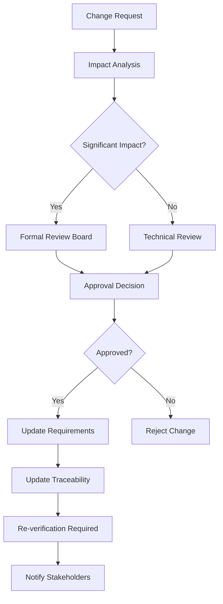

*This document represents a comprehensive markdown version of IEC 62304:2006, compiled from public source materials and optimised for AI/agent processing. It should be utilised in conjunction with the official standard and relevant regulatory guidance for medical device software development.*

# IEC 62304:2006 - Medical Device Software - Software Life Cycle Processes

## Document Structure and Metadata

**Standard**: IEC 62304:2006  
**Domain**: Medical Device Software Engineering  
**Scope**: Software Life Cycle Processes  
**Safety Classifications**: Class A (Non-injury), Class B (Non-life-threatening), Class C (Life-threatening)  
**Integration Standards**: ISO 13485, ISO 14971, IEC 60601-1  
**AI Processing Tags**: [medical-software, lifecycle-management, safety-critical, regulatory-compliance]

## Table of Contents

1. [Scope](#1-scope)
2. [Normative References](#2-normative-references)
3. [Terms and Definitions](#3-terms-and-definitions)
4. [General Requirements](#4-general-requirements)
5. [Software Development Planning](#5-software-development-planning)
6. [Software Requirements Analysis](#6-software-requirements-analysis)
7. [Software Architectural Design](#7-software-architectural-design)
8. [Software Detailed Design](#8-software-detailed-design)
9. [Software Implementation](#9-software-implementation)
10. [Software Integration and Integration Testing](#10-software-integration-and-integration-testing)
11. [Software System Testing](#11-software-system-testing)
12. [Software Release](#12-software-release)
13. [Software Maintenance Process](#13-software-maintenance-process)
14. [Software Risk Management Process](#14-software-risk-management-process)
15. [Software Configuration Management Process](#15-software-configuration-management-process)
16. [Software Problem Resolution Process](#16-software-problem-resolution-process)

---

## 1. Scope

### 1.1 General

This document specifies life cycle processes for medical device software. The set of processes, activities, and tasks described herein establishes a common framework for medical device software life cycle processes.

**AI-Agent Context**: This standard applies to medical device software and software within medical devices. The framework provides structured guidance for AI systems managing medical software development workflows.

**Exclusions**:
- Software utilised in the manufacturing of medical devices
- Software utilised in software tools that are not integral to the finished medical device
- Software that is itself a medical device or accessory to a medical device

### 1.2 Relationship to Quality Management Systems

The medical device manufacturer shall incorporate the software life cycle processes described in this standard into their quality management system. These processes are intended for utilisation in conjunction with ISO 13485.

**AI-Agent Integration Note**: Quality management systems require systematic documentation and process adherence that AI agents can support through automated compliance checking and process monitoring.

### 1.3 Software Safety Classification

This standard defines three safety classes for medical device software based upon the potential consequences of software failure:

#### Class A: Non-Injury or Damage
**Definition**: Software that cannot contribute to a hazardous situation.
**AI-Agent Processing**: Risk level = LOW, Testing requirements = BASIC, Documentation requirements = STANDARD

#### Class B: Non-Life-Threatening Injury
**Definition**: Software that could contribute to a non-life-threatening injury or damage to the patient, operator, or environment.
**AI-Agent Processing**: Risk level = MEDIUM, Testing requirements = ENHANCED, Documentation requirements = COMPREHENSIVE

#### Class C: Death or Serious Injury
**Definition**: Software that could contribute to death or serious injury to the patient, operator, or environment.
**AI-Agent Processing**: Risk level = HIGH, Testing requirements = EXTENSIVE, Documentation requirements = EXHAUSTIVE

---

## 2. Normative References

The following referenced documents are indispensable for the application of this document:

**Primary Standards**:
- **ISO 13485**: Medical devices — Quality management systems — Requirements for regulatory purposes
- **ISO 14971**: Medical devices — Application of risk management to medical devices
- **IEC 60601-1**: Medical electrical equipment — Part 1: General requirements for basic safety and essential performance
- **ISO 9000**: Quality management systems — Fundamentals and vocabulary

**AI-Agent Reference Matrix**:
```json
{
  "ISO_13485": {"scope": "quality_management", "relevance": "high", "integration_points": ["documentation", "process_control"]},
  "ISO_14971": {"scope": "risk_management", "relevance": "critical", "integration_points": ["hazard_analysis", "risk_assessment"]},
  "IEC_60601": {"scope": "safety_performance", "relevance": "medium", "integration_points": ["electrical_safety", "essential_performance"]},
  "ISO_9000": {"scope": "quality_fundamentals", "relevance": "medium", "integration_points": ["terminology", "principles"]}
}
```

---

## 3. Terms and Definitions

### 3.1 Anomaly
**Definition**: Any condition that deviates from the expected based upon requirements specifications, design documents, user documents, standards, etc., or from someone's perceptions or experiences.
**AI-Agent Tag**: [defect, deviation, quality-issue]

### 3.2 COTS Software (Commercial Off-The-Shelf)
**Definition**: Software defined by a manufacturer for commercial use that the medical device manufacturer cannot modify.
**AI-Agent Tag**: [third-party-software, unmodifiable, commercial]

### 3.3 Medical Device Software
**Definition**: Software that is itself a medical device or software that is an integral part of the medical device.
**AI-Agent Tag**: [regulated-software, medical-device, integral-component]

### 3.4 PEMS (Programmable Electrical Medical System)
**Definition**: A medical electrical system that incorporates one or more programmable electronic subsystems (PESS).
**AI-Agent Tag**: [programmable-system, electronic-medical, subsystem]

### 3.5 Software Configuration Item
**Definition**: An aggregation of software or hardware, or both, that is designated for configuration management and treated as a single entity in the configuration management process.
**AI-Agent Tag**: [configuration-management, version-control, baseline]

### 3.6 Software Item
**Definition**: An identifiable part of a computer programme (e.g., module, object, subroutine, or other discrete programming element).
**AI-Agent Tag**: [software-component, module, discrete-element]

### 3.7 Software System
**Definition**: An integrated collection of software items organised to accomplish a specific function or set of functions.
**AI-Agent Tag**: [integrated-system, functional-collection, software-assembly]

### 3.8 Software Unit
**Definition**: Software item that cannot be subdivided into other items.
**AI-Agent Tag**: [atomic-unit, indivisible, unit-testing]

### 3.9 Verification
**Definition**: Confirmation, through the provision of objective evidence, that specified requirements have been fulfilled.
**AI-Agent Tag**: [requirement-validation, objective-evidence, confirmation]

### 3.10 Validation
**Definition**: Confirmation, through the provision of objective evidence, that the requirements for a specific intended use or application have been fulfilled.
**AI-Agent Tag**: [fitness-for-purpose, intended-use, application-validation]

---

## 4. General Requirements

### 4.1 Quality Management System

The manufacturer shall establish, document, implement, and maintain a quality management system that includes the medical device software life cycle processes specified in this document.

**AI-Agent Implementation Requirements**:
- Establish automated QMS monitoring
- Implement document control systems
- Maintain process compliance tracking
- Enable audit trail generation

### 4.2 Software Life Cycle Process

The manufacturer shall implement a software life cycle process that includes the following activities:

**Process Activities Matrix**:
```json
{
  "planning": {"phase": "1", "mandatory": true, "deliverables": ["development_plan", "resource_allocation"]},
  "requirements": {"phase": "2", "mandatory": true, "deliverables": ["requirements_spec", "traceability_matrix"]},
  "architecture": {"phase": "3", "mandatory": true, "deliverables": ["architecture_document", "interface_specs"]},
  "detailed_design": {"phase": "4", "mandatory": true, "deliverables": ["design_specs", "unit_specs"]},
  "implementation": {"phase": "5", "mandatory": true, "deliverables": ["source_code", "unit_tests"]},
  "integration": {"phase": "6", "mandatory": true, "deliverables": ["integration_tests", "integration_report"]},
  "system_testing": {"phase": "7", "mandatory": true, "deliverables": ["system_tests", "test_report"]},
  "release": {"phase": "8", "mandatory": true, "deliverables": ["release_package", "release_notes"]}
}
```

### 4.3 Planning

#### 4.3.1 Software Development Plan

The manufacturer shall document software life cycle processes in a software development plan for each software system.

**Required Contents Checklist**:
- [ ] Purpose and scope of the software
- [ ] Assumptions and constraints
- [ ] Life cycle model
- [ ] Organisation and responsibilities
- [ ] Resource and schedule allocations
- [ ] Methods and tools
- [ ] Risk management activities
- [ ] Software configuration management activities
- [ ] Software problem resolution activities
- [ ] Software verification and validation activities
- [ ] Documentation requirements

#### 4.3.2 Software Development Standards and Methods

The manufacturer shall establish standards and methods to be utilised during the software development process:

**Standards Framework**:
```yaml
design_methods:
  - structured_design
  - object_oriented_design
  - model_based_design
language_criteria:
  - safety_certification
  - tool_qualification
  - maintainability
coding_standards:
  - style_guidelines
  - safety_rules
  - documentation_requirements
performance_criteria:
  - response_time_limits
  - throughput_requirements
  - resource_utilisation
verification_methods:
  - static_analysis
  - dynamic_testing
  - formal_verification
documentation_standards:
  - template_specifications
  - review_procedures
  - approval_workflows
```

### 4.4 Software Safety Classification

#### 4.4.1 Assign Safety Classes

The manufacturer shall assign a safety class to each software system based upon the potential consequences resulting from a hazard that the software system could contribute to.

**Classification Process Algorithm**:
```python
def classify_software_safety(hazards, software_contribution):
    max_severity = 0
    for hazard in hazards:
        if software_contribution[hazard] > 0:
            severity = assess_harm_severity(hazard)
            max_severity = max(max_severity, severity)
    
    if max_severity == 0:
        return "Class_A"  # No contribution to hazards
    elif max_severity <= 2:
        return "Class_B"  # Non-life-threatening
    else:
        return "Class_C"  # Life-threatening or death
```

#### 4.4.2 Segregation of Software Items

Where software items of different safety classes exist within the same software system, the manufacturer shall either:
- Assign the highest safety class to the entire system, or
- Segregate software items and apply class-specific requirements to each segregated portion

**Segregation Decision Matrix**:
| Mixed Classes | Recommended Approach | Rationale |
|---------------|---------------------|-----------|
| A + B | Segregate if cost-effective | Reduced B-class testing burden |
| A + C | Segregate mandatory | Significant cost and complexity difference |
| B + C | Segregate if architecturally feasible | Moderate benefit, high complexity |

---

## 5. Software Development Planning

### 5.1 General

The manufacturer shall plan the software development process for each software system.

**AI-Agent Planning Considerations**:
- Resource optimisation algorithms
- Schedule constraint satisfaction
- Risk-based planning prioritisation
- Automated milestone tracking

### 5.2 Plan the Software Development Process

#### 5.2.1 Software Development Plan

The manufacturer shall document the software development process in a software development plan.

**Minimum Content Requirements Structure**:

**A) Purpose and Scope**
- Software system identification
- Intended use and operational environment
- Hardware and software operating environment

**B) Organisation and Responsibilities**
- Organisational structure for the project
- Tasks and responsibilities of each organisation
- Personnel qualifications and training requirements

**C) Relationship to Overall Medical Device Development**
- Integration with overall medical device development
- Interface to medical device risk management
- Interface to medical device design controls

**D) Software Development Standards**
- Applicable development standards and methods
- Programming languages and tools
- Documentation standards
- Verification and validation standards

**E) Software Life Cycle Model**
- Description of the chosen life cycle model
- Definition of life cycle phases and deliverables
- Entry and exit criteria for each phase

**F) Verification and Validation**
- Verification and validation planning
- Methods and tools for V&V activities
- Acceptance criteria for each life cycle phase

**G) Risk Management Activities**
- Software risk management process
- Integration with medical device risk management
- Risk control measures

**H) Configuration Management**
- Configuration identification scheme
- Change control procedures
- Configuration status accounting

**I) Problem Resolution**
- Problem reporting and tracking procedures
- Problem analysis and resolution methods
- Corrective and preventive action procedures

#### 5.2.2 Keep Software Development Plan Current

The manufacturer shall keep the software development plan current throughout the software development process.

**Plan Maintenance Protocol**:
```yaml
update_triggers:
  - scope_changes
  - resource_modifications
  - schedule_adjustments
  - regulatory_updates
  - technology_changes
update_process:
  - impact_assessment
  - stakeholder_review
  - approval_workflow
  - distribution_update
  - version_control
```

### 5.3 Software Development Life Cycle Model

#### 5.3.1 Select Life Cycle Model

The manufacturer shall select an appropriate life cycle model for the development of the software system, considering:

**Selection Criteria Matrix**:
| Factor | Waterfall | V-Model | Incremental | Spiral | Agile |
|--------|-----------|---------|-------------|---------|-------|
| Project Size | Large | Large | Medium-Large | Medium | Small-Medium |
| Complexity | Low-Medium | Medium | Medium-High | High | Low-Medium |
| Requirements Stability | High | High | Medium | Low | Low |
| Risk Level | Low | Medium | Medium | High | Low |
| Regulatory Environment | High | High | Medium | Medium | Low |

**Common Life Cycle Models**:

**Waterfall Model**: 
- Sequential phases with formal reviews
- Suitable for stable requirements and low-risk projects
- Extensive documentation at each phase

**V-Model**: 
- Emphasises verification and validation
- Strong traceability between development and testing phases
- Excellent for safety-critical applications

**Incremental Model**: 
- Multiple software releases with incremental functionality
- Enables early delivery of core features
- Facilitates requirement evolution

**Spiral Model**: 
- Risk-driven iterative approach
- Continuous risk assessment and mitigation
- Suitable for high-uncertainty projects

**Agile Models**: 
- Iterative and incremental with frequent customer interaction
- Adaptive to changing requirements
- Requires careful adaptation for regulated environments

#### 5.3.2 Document Selected Model

The manufacturer shall document the rationale for selecting the life cycle model and describe how the selected model addresses the specific needs of the project.

---

## 6. Software Requirements Analysis

### 6.1 General

The manufacturer shall analyse and document the software requirements for each software system.

**AI-Agent Requirements Analysis Framework**:
- Natural language processing for requirements extraction
- Automated consistency checking
- Traceability link generation
- Requirements completeness assessment

### 6.2 Define and Document Software Requirements

#### 6.2.1 Functional and Capability Requirements

The manufacturer shall define and document software requirements including:

**A) Functional Requirements**
```yaml
input_output_specifications:
  - data_types
  - value_ranges
  - format_specifications
  - validation_rules
data_formats:
  - structure_definitions
  - encoding_standards
  - precision_requirements
processing_requirements:
  - algorithmic_specifications
  - computational_complexity
  - accuracy_requirements
response_times:
  - maximum_latency
  - throughput_specifications
  - real_time_constraints
system_behaviour:
  - state_transitions
  - error_conditions
  - boundary_conditions
```

**B) Performance Requirements**
```yaml
response_time:
  - user_interface_response
  - computational_response
  - communication_response
throughput:
  - data_processing_rate
  - transaction_volume
  - concurrent_operations
memory_utilisation:
  - maximum_allocation
  - dynamic_allocation
  - memory_leaks_prevention
resource_usage:
  - cpu_utilisation
  - storage_requirements
  - network_bandwidth
```

**C) Interface Requirements**
```yaml
hardware_interfaces:
  - sensor_interfaces
  - actuator_interfaces
  - communication_ports
software_interfaces:
  - api_specifications
  - protocol_definitions
  - data_exchange_formats
user_interfaces:
  - usability_requirements
  - accessibility_requirements
  - user_experience_specifications
communication_interfaces:
  - network_protocols
  - security_requirements
  - interoperability_standards
```

**D) Clinical Performance Requirements**
```yaml
accuracy_requirements:
  - measurement_precision
  - calculation_accuracy
  - diagnostic_accuracy
precision_requirements:
  - repeatability
  - reproducibility
  - measurement_uncertainty
clinical_safety_requirements:
  - patient_safety_measures
  - clinical_risk_controls
  - adverse_event_prevention
usability_requirements:
  - user_error_prevention
  - workflow_optimisation
  - training_requirements
```

#### 6.2.2 Software System Inputs and Outputs

The manufacturer shall identify and document:

**Input/Output Specification Template**:
```json
{
  "inputs": {
    "input_id": {
      "description": "string",
      "data_type": "string",
      "acceptable_range": {"min": "value", "max": "value"},
      "validation_rules": ["rule1", "rule2"],
      "source": "string"
    }
  },
  "outputs": {
    "output_id": {
      "description": "string",
      "data_type": "string",
      "acceptable_range": {"min": "value", "max": "value"},
      "target": "string",
      "accuracy_requirements": "string"
    }
  },
  "relationships": {
    "input_output_mapping": "mathematical_relationship",
    "dependencies": ["input1", "input2"]
  },
  "invalid_input_handling": {
    "detection_methods": ["method1", "method2"],
    "response_actions": ["action1", "action2"]
  }
}
```

#### 6.2.3 Software Requirements Content

Each software requirement shall be:

**Requirement Quality Attributes**:
- **Unambiguous**: Clear and precise meaning without interpretation ambiguity
- **Traceable**: Linked to system requirements and risk analysis
- **Testable**: Verifiable through testing or analysis methods
- **Feasible**: Technically achievable within project constraints
- **Necessary**: Required for the intended use and regulatory compliance

**AI-Agent Quality Assessment Algorithm**:
```python
def assess_requirement_quality(requirement):
    quality_score = 0
    
    # Check unambiguous
    if has_clear_language(requirement) and not has_ambiguous_terms(requirement):
        quality_score += 20
    
    # Check traceable
    if has_traceability_links(requirement):
        quality_score += 20
    
    # Check testable
    if has_acceptance_criteria(requirement) and has_measurable_outcomes(requirement):
        quality_score += 20
    
    # Check feasible
    if within_technical_constraints(requirement) and within_resource_constraints(requirement):
        quality_score += 20
    
    # Check necessary
    if supports_intended_use(requirement) and required_by_regulation(requirement):
        quality_score += 20
    
    return quality_score
```

#### 6.2.4 Include Risk Control Measures

The manufacturer shall include in software requirements the risk control measures identified by the risk management process.

**Risk Control Integration Matrix**:
| Risk Level | Control Measure Type | Implementation Location |
|------------|---------------------|------------------------|
| High | Safety by Design | Requirements & Architecture |
| Medium | Protective Measures | Software Implementation |
| Low | Information for Safety | User Interface & Documentation |

#### 6.2.5 Software Requirements Updating

The manufacturer shall establish procedures for updating software requirements:

**Change Control Workflow**:


### 6.3 Software Requirements Verification

#### 6.3.1 Verify Software Requirements

The manufacturer shall verify software requirements to ensure they:

**Verification Checklist**:
- [ ] Implement system requirements allocated to software
- [ ] Are complete, unambiguous, and consistent
- [ ] Do not contradict each other
- [ ] Are expressed in terms that permit establishment of test criteria
- [ ] Address risk control measures

**Verification Methods Framework**:

**Reviews and Analysis**:
```yaml
systematic_examination:
  - peer_review
  - formal_inspection
  - walkthrough
  - checklist_based_review
qualified_personnel:
  - domain_experts
  - requirements_specialists
  - safety_engineers
review_criteria:
  - completeness
  - consistency
  - correctness
  - traceability
```

**Prototyping**:
```yaml
feasibility_demonstrations:
  - proof_of_concept
  - user_interface_mockups
  - algorithm_validation
completeness_validation:
  - scenario_execution
  - user_story_validation
  - edge_case_exploration
```

**Modelling**:
```yaml
mathematical_models:
  - formal_specifications
  - state_machines
  - data_flow_models
simulation_models:
  - behaviour_simulation
  - performance_modelling
  - risk_scenario_analysis
```

**Testing**:
```yaml
requirement_based_tests:
  - acceptance_tests
  - scenario_tests
  - boundary_tests
executable_specifications:
  - behaviour_driven_development
  - model_based_testing
  - property_based_testing
```

#### 6.3.2 Document Verification Results

The manufacturer shall document the results of software requirements verification:

**Verification Documentation Template**:
```json
{
  "verification_activity": {
    "activity_id": "string",
    "method_used": "string",
    "participants": ["person1", "person2"],
    "date_conducted": "ISO_date",
    "requirements_verified": ["req_id1", "req_id2"]
  },
  "results": {
    "findings": [
      {
        "finding_id": "string",
        "description": "string",
        "severity": "high|medium|low",
        "requirement_affected": "req_id"
      }
    ],
    "overall_assessment": "pass|conditional_pass|fail"
  },
  "actions_taken": [
    {
      "action_id": "string",
      "description": "string",
      "responsible_person": "string",
      "due_date": "ISO_date",
      "status": "open|in_progress|completed"
    }
  ],
  "evidence": [
    {
      "evidence_type": "document|test_result|review_record",
      "location": "file_path_or_reference",
      "description": "string"
    }
  ]
}
```

### 6.4 Software Requirements Approval

#### 6.4.1 Obtain Approval

The manufacturer shall obtain approval of software requirements from authorised personnel before proceeding with architectural design.

**Approval Authority Matrix**:
| Safety Class | Required Approvers | Approval Criteria |
|-------------|-------------------|-------------------|
| Class A | Technical Lead, Quality Assurance | Technical adequacy, Quality standards |
| Class B | Technical Lead, Quality Assurance, Safety Engineer | Above + Safety assessment |
| Class C | Technical Lead, Quality Assurance, Safety Engineer, Medical Director | Above + Clinical validation |

#### 6.4.2 Approval Documentation

The approval documentation shall include:

**Approval Record Template**:
```json
{
  "approval_record": {
    "document_title": "Software Requirements Specification",
    "document_version": "string",
    "approval_date": "ISO_date",
    "approvers": [
      {
        "name": "string",
        "role": "string",
        "signature": "electronic_signature",
        "approval_scope": "full|conditional|partial"
      }
    ],
    "conditions_constraints": [
      {
        "condition_id": "string",
        "description": "string",
        "resolution_required": "boolean"
      }
    ],
    "next_review_date": "ISO_date",
    "distribution_list": ["person1", "person2"]
  }
}
```

---

## 7. Software Architectural Design

### 7.1 General

The manufacturer shall transform software requirements into an architecture that describes the software's top-level structure and identifies the principal structural elements and their interfaces.

**AI-Agent Architecture Analysis Framework**:
- Pattern recognition for architectural styles
- Component dependency analysis
- Interface consistency checking
- Performance characteristic prediction

### 7.2 Develop Software Architecture

#### 7.2.1 Transform Requirements into Architecture

The manufacturer shall develop a software architecture from the software requirements that:

**Architecture Development Checklist**:
- [ ] Defines the major structural elements of the software
- [ ] Describes interfaces between elements
- [ ] Allocates software requirements to structural elements
- [ ] Addresses non-functional requirements (performance, reliability, security)

**Architectural Transformation Process**:
```python
def transform_requirements_to_architecture(requirements):
    architecture = {
        "components": [],
        "interfaces": [],
        "allocations": {},
        "non_functional_measures": {}
    }
    
    # Identify major functional areas
    functional_areas = group_requirements_by_function(requirements)
    
    # Create architectural components
    for area in functional_areas:
        component = create_component(area)
        architecture["components"].append(component)
    
    # Define interfaces
    interfaces = identify_interfaces(architecture["components"])
    architecture["interfaces"].extend(interfaces)
    
    # Allocate requirements
    for requirement in requirements:
        responsible_components = determine_allocation(requirement, architecture["components"])
        architecture["allocations"][requirement.id] = responsible_components
    
    # Address non-functional requirements
    architecture["non_functional_measures"] = address_non_functional(requirements)
    
    return architecture
```

#### 7.2.2 Document Software Architecture

The manufacturer shall document the software architecture including:

**A) Architectural Design Description**

**Architecture Documentation Structure**:
```yaml
overview:
  - architectural_style: "layered|microservices|component_based|event_driven"
  - design_principles: ["separation_of_concerns", "modularity", "reusability"]
  - key_design_decisions: ["technology_choices", "pattern_applications"]
  
major_components:
  - component_name:
      responsibilities: ["responsibility1", "responsibility2"]
      functionality: "detailed_description"
      interfaces: ["interface1", "interface2"]
      dependencies: ["component1", "component2"]
      
component_relationships:
  - interaction_patterns: ["client_server", "publisher_subscriber", "pipeline"]
  - data_flow: "description_of_data_movement"
  - control_flow: "description_of_control_flow"
```

**B) Interface Specifications**

**Interface Documentation Template**:
```json
{
  "interface_id": "unique_identifier",
  "interface_name": "descriptive_name",
  "type": "internal|external|user|communication",
  "components": {
    "provider": "component_name",
    "consumer": "component_name"
  },
  "specification": {
    "protocol": "http|tcp|udp|shared_memory|api",
    "data_format": "json|xml|binary|custom",
    "operations": [
      {
        "operation_name": "string",
        "parameters": [
          {
            "name": "string",
            "type": "string",
            "constraints": "string"
          }
        ],
        "return_type": "string",
        "preconditions": ["condition1"],
        "postconditions": ["condition1"],
        "exceptions": ["exception1"]
      }
    ],
    "timing_requirements": {
      "response_time_max": "duration",
      "throughput_min": "rate"
    },
    "reliability_requirements": {
      "availability": "percentage",
      "error_handling": "strategy"
    }
  }
}
```

**C) Segregation Between Software Items**

**Safety Segregation Framework**:
```yaml
segregation_mechanisms:
  temporal_separation:
    - time_partitioning
    - scheduling_policies
    - execution_slots
  spatial_separation:
    - memory_protection
    - address_space_isolation
    - hardware_boundaries
  logical_separation:
    - access_control_matrices
    - privilege_levels
    - permission_systems
    
isolation_barriers:
  hardware_barriers:
    - memory_management_units
    - privileged_instruction_sets
    - hardware_watchdogs
  software_barriers:
    - operating_system_services
    - middleware_isolation
    - application_sandboxing
    
access_control:
  authentication_mechanisms:
    - user_credentials
    - system_certificates
    - cryptographic_tokens
  authorisation_policies:
    - role_based_access
    - attribute_based_access
    - mandatory_access_control
```

### 7.3 Develop Each Software Item

#### 7.3.1 Refine the Software Architecture

For each software item identified in the architecture, the manufacturer shall:

**Software Item Development Process**:
```python
def refine_software_item(architectural_component):
    software_item = {
        "refined_requirements": [],
        "interfaces": [],
        "algorithms": [],
        "data_structures": [],
        "relationships": []
    }
    
    # Refine requirements
    software_item["refined_requirements"] = refine_requirements(
        architectural_component.allocated_requirements
    )
    
    # Develop interfaces
    software_item["interfaces"] = develop_item_interfaces(
        architectural_component.external_interfaces
    )
    
    # Select algorithms and data structures
    software_item["algorithms"] = select_algorithms(
        software_item["refined_requirements"]
    )
    software_item["data_structures"] = select_data_structures(
        software_item["algorithms"]
    )
    
    # Identify relationships
    software_item["relationships"] = identify_relationships(
        architectural_component, other_components
    )
    
    return software_item
```

#### 7.3.2 Specify Software Item Interfaces

The manufacturer shall specify interfaces for each software item:

**Interface Specification Framework**:
```yaml
function_interfaces:
  interface_name:
    signature: "return_type function_name(parameter_list)"
    parameters:
      - name: "parameter_name"
        type: "data_type"
        direction: "in|out|inout"
        constraints: "validation_rules"
    return_value:
      type: "data_type"
      constraints: "validation_rules"
    exceptions:
      - exception_type: "string"
        conditions: "when_thrown"
        
data_interfaces:
  interface_name:
    format: "structure_definition"
    encoding: "binary|text|json|xml"
    validation_rules: ["rule1", "rule2"]
    versioning: "compatibility_requirements"
    
control_interfaces:
  interface_name:
    timing_requirements:
      synchronous: "boolean"
      timeout: "duration"
      periodicity: "interval"
    sequencing:
      call_order: "sequence_constraints"
      state_dependencies: "required_states"
      
error_handling:
  error_codes: ["code1", "code2"]
  error_recovery: "strategy_description"
  logging_requirements: "what_to_log"
```

### 7.4 Software Architectural Design Verification

#### 7.4.1 Verify Software Architecture

The manufacturer shall verify that the software architecture:

**Architecture Verification Checklist**:
- [ ] Implements software requirements completely and correctly
- [ ] Is able to support interfaces defined in system design
- [ ] Is appropriate for the medical device application domain
- [ ] Supports proper operation of any SOUP (Software of Unknown Provenance)

**Verification Methods Selection Matrix**:

| Verification Aspect | Design Reviews | Prototyping | Analysis | Testing |
|---------------------|---------------|-------------|----------|---------|
| Requirements Implementation | ✓ | ✓ | ✓ | - |
| Interface Compatibility | ✓ | ✓ | ✓ | ✓ |
| Medical Device Appropriateness | ✓ | - | ✓ | - |
| SOUP Integration | ✓ | ✓ | ✓ | ✓ |
| Performance Characteristics | - | ✓ | ✓ | ✓ |
| Safety Properties | ✓ | - | ✓ | - |

**AI-Agent Verification Automation**:
```python
def verify_architecture(architecture, requirements, system_interfaces):
    verification_results = {
        "requirements_coverage": check_requirements_coverage(architecture, requirements),
        "interface_compatibility": check_interface_compatibility(architecture, system_interfaces),
        "architectural_consistency": check_internal_consistency(architecture),
        "soup_integration": verify_soup_integration(architecture),
        "performance_feasibility": analyse_performance_characteristics(architecture)
    }
    
    overall_status = aggregate_verification_results(verification_results)
    return verification_results, overall_status
```

#### 7.4.2 Document Verification Results

The manufacturer shall document architectural design verification results:

**Verification Results Documentation Template**:
```json
{
  "verification_summary": {
    "architecture_version": "string",
    "verification_date": "ISO_date",
    "verification_team": ["person1", "person2"],
    "overall_result": "pass|conditional_pass|fail"
  },
  "verification_activities": [
    {
      "activity_type": "design_review|prototyping|analysis|testing",
      "scope": "requirements_implementation|interface_compatibility|medical_appropriateness|soup_integration",
      "method_details": "specific_method_or_tool_used",
      "participants": ["person1", "person2"],
      "duration": "hours_or_days",
      "findings": [
        {
          "finding_id": "string",
          "description": "string",
          "severity": "critical|major|minor|observation",
          "architectural_element": "affected_component_or_interface",
          "recommendation": "suggested_action"
        }
      ]
    }
  ],
  "actions_taken": [
    {
      "action_id": "string",
      "finding_addressed": "finding_id",
      "description": "corrective_action_description",
      "implementation_status": "planned|in_progress|completed",
      "verification_of_fix": "how_fix_was_verified"
    }
  ],
  "evidence_repository": {
    "review_records": ["file_reference1"],
    "analysis_reports": ["file_reference2"],
    "prototype_results": ["file_reference3"],
    "test_results": ["file_reference4"]
  }
}
```

---

## 8. Software Detailed Design

### 8.1 General

The manufacturer shall develop a detailed design for each software item sufficient for that software item to be implemented and tested.

**AI-Agent Detailed Design Framework**:
- Automated design pattern recognition and application
- Code structure generation from design specifications
- Test case derivation from design elements
- Design consistency checking across software items

### 8.2 Refine the Software Architecture into a Detailed Design

#### 8.2.1 Detailed Design Development

The manufacturer shall develop detailed design for each software item that:

**Design Development Requirements Matrix**:
| Requirement | Description | AI-Agent Support |
|------------|-------------|------------------|
| Architecture Refinement | Elaborate architectural components into implementable units | Pattern-based decomposition |
| Interface Definition | Specify precise interfaces between software units | API specification generation |
| Algorithm Description | Define computational methods and data transformations | Algorithm template library |
| Resource Specification | Detail timing, memory, and performance requirements | Resource estimation models |

**Detailed Design Process Flow**:
```python
def develop_detailed_design(software_item):
    detailed_design = {
        "software_units": [],
        "unit_interfaces": [],
        "data_structures": [],
        "algorithms": [],
        "resource_requirements": {}
    }
    
    # Decompose software item into units
    units = decompose_into_units(software_item)
    for unit in units:
        detailed_unit = design_software_unit(unit)
        detailed_design["software_units"].append(detailed_unit)
    
    # Define unit interfaces
    interfaces = derive_unit_interfaces(detailed_design["software_units"])
    detailed_design["unit_interfaces"] = interfaces
    
    # Specify data structures
    detailed_design["data_structures"] = design_data_structures(
        software_item.data_requirements
    )
    
    # Detail algorithms
    detailed_design["algorithms"] = specify_algorithms(
        software_item.functional_requirements
    )
    
    # Calculate resource requirements
    detailed_design["resource_requirements"] = estimate_resources(
        detailed_design
    )
    
    return detailed_design
```

#### 8.2.2 Document Detailed Design

The manufacturer shall document the detailed design including:

**A) Software Item Design Description**

**Design Documentation Structure**:
```yaml
software_item_overview:
  purpose: "clear_statement_of_item_purpose"
  scope: "boundaries_and_limitations"
  context: "relationship_to_other_items"
  
functionality_specification:
  inputs:
    - name: "input_name"
      type: "data_type"
      source: "origin_description"
      validation: "input_validation_rules"
  outputs:
    - name: "output_name"
      type: "data_type"
      destination: "target_description"
      constraints: "output_constraints"
  processing_logic:
    - step_description: "detailed_processing_step"
      algorithms_used: ["algorithm1", "algorithm2"]
      decision_points: ["condition1", "condition2"]
      
data_structures:
  - structure_name: "identifier"
    type: "class|struct|array|list|tree|graph"
    definition: "formal_structure_definition"
    operations: ["operation1", "operation2"]
    invariants: ["invariant1", "invariant2"]
    
algorithm_descriptions:
  - algorithm_name: "identifier"
    purpose: "what_the_algorithm_accomplishes"
    complexity: "time_and_space_complexity"
    pseudocode: "step_by_step_algorithm"
    error_conditions: ["error1", "error2"]
    performance_characteristics: "expected_performance"
```

**B) Interface Specifications**

**Detailed Interface Documentation Template**:
```json
{
  "interface_specification": {
    "interface_id": "unique_identifier",
    "interface_type": "function_call|data_exchange|event_notification|control_signal",
    "participants": {
      "caller": "software_unit_name",
      "callee": "software_unit_name"
    },
    "detailed_definition": {
      "signature": "formal_interface_signature",
      "parameters": [
        {
          "name": "parameter_name",
          "data_type": "specific_type_definition",
          "direction": "input|output|input_output",
          "constraints": {
            "range": "min_max_values",
            "format": "data_format_specification",
            "validation_rules": ["rule1", "rule2"]
          },
          "default_value": "default_if_applicable"
        }
      ],
      "return_value": {
        "data_type": "return_type_specification",
        "success_conditions": "when_successful",
        "error_conditions": "when_errors_occur"
      }
    },
    "error_handling": {
      "exception_types": ["exception1", "exception2"],
      "error_codes": [
        {
          "code": "error_code_value",
          "description": "error_meaning",
          "recovery_action": "suggested_response"
        }
      ],
      "error_propagation": "how_errors_are_communicated"
    },
    "timing_requirements": {
      "synchronisation": "synchronous|asynchronous",
      "timeout_specification": "maximum_wait_time",
      "periodicity": "call_frequency_if_applicable"
    },
    "sequencing_requirements": {
      "prerequisite_calls": ["required_prior_calls"],
      "state_dependencies": ["required_system_states"],
      "concurrent_access": "thread_safety_specification"
    }
  }
}
```

**C) Software Unit Specifications**

**Unit Specification Framework**:
```yaml
software_unit:
  identification:
    unit_name: "unique_identifier"
    version: "version_number"
    author: "developer_name"
    creation_date: "ISO_date"
    
  purpose_and_functionality:
    primary_function: "main_responsibility"
    secondary_functions: ["additional_responsibilities"]
    assumptions: ["assumption1", "assumption2"]
    limitations: ["limitation1", "limitation2"]
    
  interfaces:
    provided_interfaces: ["interface1", "interface2"]
    required_interfaces: ["interface3", "interface4"]
    internal_interfaces: ["interface5"]
    
  dependencies:
    software_dependencies: ["unit1", "unit2"]
    hardware_dependencies: ["hardware_resource1"]
    external_dependencies: ["library1", "service1"]
    
  implementation_requirements:
    programming_language: "language_specification"
    coding_standards: ["standard1", "standard2"]
    performance_requirements:
      execution_time: "maximum_duration"
      memory_usage: "maximum_allocation"
      throughput: "minimum_rate"
    reliability_requirements:
      error_handling: "error_handling_strategy"
      fault_tolerance: "fault_tolerance_approach"
      recovery_mechanisms: ["recovery1", "recovery2"]
      
  testing_requirements:
    unit_test_coverage: "minimum_coverage_percentage"
    test_data_requirements: "test_data_specifications"
    test_environment: "testing_environment_setup"
    acceptance_criteria: ["criterion1", "criterion2"]
```

### 8.3 Software Detailed Design Verification

#### 8.3.1 Verify Detailed Design

The manufacturer shall verify that the detailed design:

**Design Verification Checklist**:
- [ ] Implements the software architecture correctly and completely
- [ ] Is free from internal contradictions
- [ ] Uses appropriate algorithms and data structures for the application
- [ ] Supports the intended medical device functionality

**Verification Methods Application Matrix**:

| Verification Method | Architecture Implementation | Contradiction Detection | Algorithm Appropriateness | Medical Functionality |
|---------------------|----------------------------|------------------------|---------------------------|----------------------|
| **Design Reviews** | ✓ | ✓ | ✓ | ✓ |
| **Static Analysis** | ✓ | ✓ | ✓ | - |
| **Prototyping** | ✓ | - | ✓ | ✓ |
| **Mathematical Modeling** | - | ✓ | ✓ | - |

**AI-Agent Verification Automation Framework**:
```python
def verify_detailed_design(detailed_design, architecture, medical_requirements):
    verification_results = {}
    
    # Verify architecture implementation
    verification_results["architecture_implementation"] = verify_architecture_implementation(
        detailed_design, architecture
    )
    
    # Check for contradictions
    verification_results["contradiction_analysis"] = analyse_contradictions(
        detailed_design
    )
    
    # Evaluate algorithm appropriateness
    verification_results["algorithm_evaluation"] = evaluate_algorithms(
        detailed_design.algorithms, medical_requirements
    )
    
    # Verify medical functionality support
    verification_results["medical_functionality"] = verify_medical_support(
        detailed_design, medical_requirements
    )
    
    # Generate overall assessment
    overall_result = synthesise_verification_results(verification_results)
    
    return verification_results, overall_result

def verify_architecture_implementation(detailed_design, architecture):
    """Verify detailed design implements architectural decisions"""
    implementation_gaps = []
    
    for architectural_component in architecture.components:
        corresponding_units = find_implementing_units(
            detailed_design, architectural_component
        )
        
        if not corresponding_units:
            implementation_gaps.append({
                "component": architectural_component.name,
                "issue": "No implementing software units found"
            })
        else:
            # Verify functionality coverage
            required_functions = architectural_component.functions
            implemented_functions = extract_functions(corresponding_units)
            
            missing_functions = set(required_functions) - set(implemented_functions)
            if missing_functions:
                implementation_gaps.append({
                    "component": architectural_component.name,
                    "issue": f"Missing functions: {missing_functions}"
                })
    
    return {
        "status": "complete" if not implementation_gaps else "incomplete",
        "gaps": implementation_gaps
    }

def analyse_contradictions(detailed_design):
    """Detect internal contradictions in the detailed design"""
    contradictions = []
    
    # Check interface consistency
    interface_contradictions = check_interface_consistency(detailed_design.unit_interfaces)
    contradictions.extend(interface_contradictions)
    
    # Check data structure consistency
    data_contradictions = check_data_structure_consistency(detailed_design.data_structures)
    contradictions.extend(data_contradictions)
    
    # Check algorithm consistency
    algorithm_contradictions = check_algorithm_consistency(detailed_design.algorithms)
    contradictions.extend(algorithm_contradictions)
    
    return {
        "contradiction_count": len(contradictions),
        "contradictions": contradictions,
        "status": "consistent" if not contradictions else "inconsistent"
    }
```

#### 8.3.2 Document Verification Results

The manufacturer shall document detailed design verification including:

**Verification Documentation Template**:
```json
{
  "verification_overview": {
    "design_version": "string",
    "verification_period": {
      "start_date": "ISO_date",
      "end_date": "ISO_date"
    },
    "verification_team": [
      {
        "name": "string",
        "role": "design_reviewer|static_analyser|prototyper|domain_expert",
        "qualifications": "relevant_experience_and_skills"
      }
    ],
    "verification_scope": "full_design|specific_units|specific_aspects"
  },
  
  "verification_activities": [
    {
      "activity_id": "unique_identifier",
      "method": "design_review|static_analysis|prototyping|mathematical_modelling",
      "scope": "architecture_implementation|contradiction_detection|algorithm_evaluation|medical_functionality",
      "execution_details": {
        "duration": "time_spent",
        "tools_used": ["tool1", "tool2"],
        "criteria_applied": ["criterion1", "criterion2"]
      },
      "results": {
        "findings": [
          {
            "finding_id": "string",
            "category": "architecture|interface|algorithm|data_structure|performance|medical",
            "severity": "critical|major|minor|informational",
            "description": "detailed_finding_description",
            "affected_elements": ["element1", "element2"],
            "evidence": "supporting_evidence_reference"
          }
        ],
        "metrics": {
          "coverage_achieved": "percentage",
          "defect_density": "defects_per_unit",
          "review_efficiency": "findings_per_hour"
        }
      }
    }
  ],
  
  "issue_resolution": [
    {
      "finding_id": "reference_to_finding",
      "resolution_approach": "design_modification|clarification|exception_approval",
      "implementation_details": "what_was_changed_or_clarified",
      "verification_of_resolution": "how_resolution_was_confirmed",
      "responsible_person": "person_who_implemented_resolution",
      "completion_date": "ISO_date"
    }
  ],
  
  "design_adequacy_assessment": {
    "overall_rating": "adequate|adequate_with_conditions|inadequate",
    "adequacy_evidence": [
      {
        "evidence_type": "review_consensus|analysis_results|prototype_demonstration",
        "description": "evidence_description",
        "supporting_documents": ["document_reference1"]
      }
    ],
    "conditions_for_proceeding": [
      "condition_that_must_be_met_before_implementation"
    ],
    "recommendations": [
      "recommendation_for_improvement_or_consideration"
    ]
  }
}
```

---

## 9. Software Implementation

### 9.1 General

The manufacturer shall implement each software unit and document the implementation.

**AI-Agent Implementation Support Framework**:
- Code generation from detailed design specifications
- Automated coding standard compliance checking
- Real-time implementation progress tracking
- Integration with version control and build systems

### 9.2 Implement Each Software Unit

#### 9.2.1 Software Implementation

The manufacturer shall implement each software unit according to the detailed design and document the implementation.

**Implementation Requirements Framework**:
```yaml
transformation_requirements:
  design_to_code:
    - faithful_translation: "Preserve all design decisions in code"
    - traceability_maintenance: "Maintain links between design elements and code"
    - design_intent_preservation: "Code should express design intentions clearly"
    
coding_standards_compliance:
  style_guidelines:
    - naming_conventions: "Consistent identifier naming"
    - formatting_standards: "Code layout and indentation"
    - commenting_standards: "Documentation within code"
  safety_rules:
    - memory_management: "Safe allocation and deallocation"
    - error_handling: "Comprehensive error detection and response"
    - defensive_programming: "Input validation and boundary checking"
    
functionality_implementation:
  completeness:
    - all_specified_functions: "Implement every function in the design"
    - all_specified_behaviours: "Implement all described behaviours"
    - all_interface_contracts: "Fulfill all interface specifications"
  correctness:
    - algorithm_fidelity: "Algorithms match design specifications"
    - data_structure_consistency: "Data structures match design"
    - interface_compliance: "Interfaces match specifications exactly"
    
error_handling_implementation:
  error_detection:
    - input_validation: "Check all inputs against constraints"
    - boundary_condition_detection: "Identify out-of-range conditions"
    - system_state_validation: "Verify system state assumptions"
  error_response:
    - graceful_degradation: "Maintain system stability during errors"
    - error_reporting: "Provide meaningful error information"
    - recovery_mechanisms: "Attempt to recover from recoverable errors"
    
traceability_maintenance:
  design_to_code_links:
    - requirement_traceability: "Link code to originating requirements"
    - design_element_mapping: "Map code structures to design elements"
    - decision_rationale: "Document why specific implementation choices were made"
```

**AI-Agent Implementation Process**:
```python
def implement_software_unit(unit_design, coding_standards, traceability_requirements):
    implementation = {
        "source_files": [],
        "documentation": {},
        "traceability_links": {},
        "compliance_status": {}
    }
    
    # Generate source code from design
    source_code = generate_code_from_design(
        unit_design, 
        coding_standards
    )
    
    # Apply coding standards
    compliant_code = apply_coding_standards(
        source_code, 
        coding_standards
    )
    
    # Add error handling
    robust_code = add_error_handling(
        compliant_code, 
        unit_design.error_specifications
    )
    
    # Generate documentation
    implementation["documentation"] = generate_implementation_documentation(
        unit_design, 
        robust_code
    )
    
    # Establish traceability
    implementation["traceability_links"] = establish_traceability(
        robust_code, 
        unit_design, 
        traceability_requirements
    )
    
    # Verify compliance
    implementation["compliance_status"] = verify_implementation_compliance(
        robust_code, 
        unit_design, 
        coding_standards
    )
    
    implementation["source_files"] = robust_code
    
    return implementation
```

#### 9.2.2 Implementation Documentation

The manufacturer shall document software implementation including:

**Implementation Documentation Structure**:
```yaml
source_code_documentation:
  code_organization:
    - file_structure: "How source files are organized"
    - module_relationships: "Dependencies between code modules"
    - build_structure: "How components are built and linked"
    
  inline_documentation:
    - header_comments:
        file_purpose: "What this file accomplishes"
        author_information: "Who wrote and maintains this code"
        version_history: "Changes made over time"
        dependencies: "What this file requires to function"
    - function_comments:
        purpose: "What the function does"
        parameters: "Description of each parameter"
        return_values: "What the function returns"
        side_effects: "Any changes the function makes"
        preconditions: "What must be true before calling"
        postconditions: "What will be true after calling"
    - complex_algorithm_comments:
        algorithm_explanation: "How the algorithm works"
        complexity_analysis: "Time and space complexity"
        edge_case_handling: "Special cases considered"
        
build_procedures:
  compilation_instructions:
    - compiler_requirements: "Required compiler version and features"
    - compilation_flags: "Specific flags needed for correct compilation"
    - optimization_settings: "Performance and safety optimization choices"
    - conditional_compilation: "Platform or configuration-specific code"
    
  build_dependencies:
    - required_libraries: "External libraries needed"
    - build_tools: "Tools required for the build process"
    - platform_requirements: "Operating system and hardware requirements"
    
  build_procedures:
    - step_by_step_instructions: "Exact steps to build the software"
    - verification_procedures: "How to verify successful build"
    - troubleshooting_guide: "Common build problems and solutions"
    
implementation_decisions:
  design_alternatives:
    - considered_options: "Alternative implementations considered"
    - selection_rationale: "Why the chosen approach was selected"
    - trade_off_analysis: "Benefits and drawbacks of the chosen approach"
    
  platform_specific_decisions:
    - portability_considerations: "How platform differences are handled"
    - performance_optimizations: "Platform-specific optimizations applied"
    - safety_considerations: "Platform-specific safety measures"
    
traceability_documentation:
  design_to_code_mapping:
    - design_element_references: "Which design elements are implemented where"
    - requirement_implementation: "How each requirement is implemented"
    - interface_implementation: "How interfaces are realized in code"
    
  change_tracking:
    - modification_history: "Changes made during implementation"
    - rationale_for_changes: "Why changes were necessary"
    - impact_assessment: "Effects of changes on other components"
```

**Implementation Documentation Template**:
```json
{
  "implementation_package": {
    "unit_identifier": "software_unit_name",
    "version": "implementation_version",
    "implementation_date": "ISO_date",
    "implementer": "developer_name",
    "design_reference": "detailed_design_document_reference"
  },
  
  "source_code_inventory": [
    {
      "file_name": "source_file_name",
      "file_type": "header|source|configuration|build_script",
      "purpose": "what_this_file_provides",
      "size_metrics": {
        "lines_of_code": "integer",
        "lines_of_comments": "integer",
        "complexity_measure": "cyclomatic_complexity_or_similar"
      },
      "dependencies": ["file1", "file2"],
      "interfaces_implemented": ["interface1", "interface2"]
    }
  ],
  
  "build_configuration": {
    "build_environment": {
      "compiler": "compiler_name_and_version",
      "build_tools": ["tool1", "tool2"],
      "target_platform": "platform_specification"
    },
    "build_settings": {
      "compilation_flags": ["flag1", "flag2"],
      "optimization_level": "optimization_setting",
      "debugging_symbols": "enabled|disabled",
      "static_analysis": "tools_and_settings_used"
    },
    "build_procedure": {
      "build_steps": ["step1", "step2"],
      "build_verification": "how_to_verify_successful_build",
      "build_artifacts": ["artifact1", "artifact2"]
    }
  },
  
  "implementation_decisions": [
    {
      "decision_category": "algorithm|data_structure|interface|error_handling|performance",
      "design_specification": "what_the_design_specified",
      "implementation_choice": "what_was_actually_implemented",
      "rationale": "why_this_choice_was_made",
      "alternatives_considered": ["alternative1", "alternative2"],
      "trade_offs": "benefits_and_drawbacks"
    }
  ],
  
  "traceability_matrix": [
    {
      "design_element": "design_element_identifier",
      "code_location": "file_name:line_number_or_function_name",
      "implementation_notes": "how_the_design_element_is_implemented"
    }
  ]
}
```

### 9.3 Software Unit Verification (Unit Testing)

#### 9.3.1 Establish Software Unit Verification Process

The manufacturer shall establish a software unit verification process including:

**Unit Verification Process Framework**:
```yaml
unit_test_planning:
  test_strategy:
    - testing_approach: "white_box|black_box|grey_box"
    - coverage_criteria: "statement|branch|condition|path"
    - test_case_design_methods: ["equivalence_partitioning", "boundary_value_analysis", "decision_table"]
    
  test_environment_requirements:
    - hardware_requirements: "Required hardware for testing"
    - software_requirements: "Operating system, libraries, test frameworks"
    - test_data_requirements: "Test inputs, expected outputs, test databases"
    - isolation_requirements: "How to isolate units for testing"
    
test_environment_setup:
  test_harness_design:
    - driver_programs: "Programs that call the unit being tested"
    - stub_programs: "Programs that simulate called units"
    - test_data_generators: "Tools to generate test inputs"
    - result_comparators: "Tools to verify test outputs"
    
  configuration_management:
    - version_control: "How test code and data are managed"
    - baseline_establishment: "Known good configurations"
    - change_control: "How test environment changes are managed"
    
test_data_management:
  test_data_categories:
    - normal_operation_data: "Typical inputs and expected outputs"
    - boundary_condition_data: "Edge cases and limits"
    - error_condition_data: "Invalid inputs and error scenarios"
    - stress_test_data: "High-volume or high-frequency inputs"
    
  test_data_generation:
    - manual_creation: "Hand-crafted test cases for specific scenarios"
    - automated_generation: "Tools to generate large volumes of test data"
    - real_world_data: "Actual data from medical device operation"
    - synthetic_data: "Artificially generated data matching real patterns"
    
test_execution_framework:
  automated_testing:
    - test_framework_selection: "Tools for automated test execution"
    - continuous_integration: "Integration with build systems"
    - regression_testing: "Automated re-testing after changes"
    
  manual_testing:
    - test_procedure_documentation: "Step-by-step manual test procedures"
    - result_recording: "How to document manual test results"
    - repeatability_measures: "Ensuring consistent manual testing"
    
result_documentation:
  test_result_recording:
    - test_execution_logs: "Detailed logs of test execution"
    - coverage_reports: "Code coverage analysis results"
    - defect_reports: "Documentation of failures and issues"
    
  result_analysis:
    - pass_fail_criteria: "Clear criteria for test success"
    - trend_analysis: "Analysis of test results over time"
    - quality_metrics: "Measures of test effectiveness"
```

#### 9.3.2 Software Unit Testing

The manufacturer shall test each software unit to verify that it:

**Unit Testing Requirements Matrix**:
| Verification Aspect | Testing Method | Success Criteria |
|---------------------|----------------|------------------|
| Design Implementation | Functional Testing | All specified functions work correctly |
| Specification Compliance | Interface Testing | All interface contracts are fulfilled |
| Boundary Handling | Boundary Value Testing | Correct behaviour at limits and edges |
| Error Reporting | Error Injection Testing | Appropriate error detection and reporting |

**Unit Testing Techniques Framework**:
```yaml
structural_testing_techniques:
  statement_coverage:
    definition: "Every executable statement is executed at least once"
    measurement: "Percentage of statements executed during testing"
    tools: ["gcov", "lcov", "JaCoCo", "OpenCover"]
    target_coverage: "100% for safety-critical code"
    
  branch_coverage:
    definition: "Every decision branch is exercised at least once"
    measurement: "Percentage of decision outcomes tested"
    includes: ["if_statement_branches", "switch_case_branches", "loop_conditions"]
    target_coverage: "100% for Class B and C software"
    
  condition_coverage:
    definition: "Every Boolean sub-expression is evaluated to both true and false"
    measurement: "Percentage of condition combinations tested"
    complexity: "Exponential growth with condition count"
    practical_application: "Focus on safety-critical conditions"
    
  path_coverage:
    definition: "Every possible execution path through the unit is tested"
    measurement: "Percentage of unique paths exercised"
    limitations: "Exponential path explosion, loops create infinite paths"
    practical_application: "Limited to small units with few paths"
    
functional_testing_techniques:
  equivalence_partitioning:
    definition: "Divide input domain into equivalence classes"
    application: "Test one representative from each class"
    benefits: "Reduces test case count while maintaining coverage"
    
  boundary_value_analysis:
    definition: "Focus testing on boundaries of equivalence classes"
    rationale: "Errors often occur at boundaries"
    test_points: ["minimum", "maximum", "just_below_minimum", "just_above_maximum"]
    
  decision_table_testing:
    definition: "Systematic testing of complex business logic"
    application: "Multiple input conditions with complex relationships"
    benefits: "Ensures all condition combinations are considered"
    
error_handling_testing:
  invalid_input_testing:
    null_pointer_tests: "Pass null pointers where not expected"
    out_of_range_tests: "Values outside acceptable ranges"
    malformed_data_tests: "Incorrectly formatted input data"
    
  resource_exhaustion_testing:
    memory_exhaustion: "Test behaviour when memory allocation fails"
    disk_space_exhaustion: "Test behaviour when storage is full"
    network_failure: "Test behaviour when network is unavailable"
    
  exception_handling_testing:
    exception_propagation: "Verify exceptions are properly propagated"
    exception_recovery: "Test recovery from exception conditions"
    resource_cleanup: "Verify resources are cleaned up after exceptions"
```

**AI-Agent Testing Automation Framework**:
```python
def execute_unit_testing(software_unit, test_specifications, coverage_requirements):
    testing_results = {
        "test_execution_summary": {},
        "coverage_analysis": {},
        "defect_reports": [],
        "quality_metrics": {}
    }
    
    # Generate test cases
    test_cases = generate_test_cases(software_unit, test_specifications)
    
    # Execute functional tests
    functional_results = execute_functional_tests(software_unit, test_cases)
    testing_results["functional_results"] = functional_results
    
    # Execute structural tests
    structural_results = execute_structural_tests(software_unit, coverage_requirements)
    testing_results["structural_results"] = structural_results
    
    # Analyse coverage
    coverage_analysis = analyse_code_coverage(structural_results)
    testing_results["coverage_analysis"] = coverage_analysis
    
    # Generate defect reports
    defects = identify_defects(functional_results, structural_results)
    testing_results["defect_reports"] = defects
    
    # Calculate quality metrics
    quality_metrics = calculate_quality_metrics(testing_results)
    testing_results["quality_metrics"] = quality_metrics
    
    return testing_results

def generate_test_cases(software_unit, test_specifications):
    """Generate comprehensive test cases for a software unit"""
    test_cases = []
    
    # Generate normal operation test cases
    normal_cases = generate_normal_operation_tests(software_unit.interfaces)
    test_cases.extend(normal_cases)
    
    # Generate boundary test cases
    boundary_cases = generate_boundary_tests(software_unit.input_constraints)
    test_cases.extend(boundary_cases)
    
    # Generate error condition test cases
    error_cases = generate_error_condition_tests(software_unit.error_specifications)
    test_cases.extend(error_cases)
    
    # Generate stress test cases
    stress_cases = generate_stress_tests(software_unit.performance_requirements)
    test_cases.extend(stress_cases)
    
    return test_cases
```

#### 9.3.3 Unit Testing for Different Safety Classes

**Safety Class-Specific Testing Requirements**:

**Class A Software Units**:
```yaml
testing_requirements:
  scope: "Test all software units"
  coverage_criteria: "Basic functional testing"
  documentation: "Standard test documentation"
  
test_execution:
  functional_testing: "Verify basic functionality works"
  error_handling: "Basic error condition testing"
  interface_testing: "Verify interface contracts"
  
coverage_targets:
  functional_coverage: "All specified functions tested"
  statement_coverage: "Recommended but not required"
  branch_coverage: "Not required"
  
documentation_requirements:
  test_procedures: "Basic test case documentation"
  test_results: "Pass/fail results recording"
  defect_tracking: "Basic defect identification and resolution"
```

**Class B Software Units**:
```yaml
testing_requirements:
  scope: "Test all software units"
  coverage_criteria: "Statement coverage OR branch coverage"
  documentation: "Comprehensive test documentation"
  
test_execution:
  functional_testing: "Comprehensive functional verification"
  error_handling: "Thorough error condition testing"
  interface_testing: "Complete interface verification"
  boundary_testing: "Systematic boundary value testing"
  
coverage_targets:
  functional_coverage: "All specified functions tested"
  structural_coverage: "Statement coverage OR branch coverage"
  minimum_threshold: "≥95% coverage of selected criterion"
  
documentation_requirements:
  test_procedures: "Detailed test case specifications"
  test_results: "Comprehensive result documentation"
  coverage_analysis: "Coverage measurement and analysis"
  defect_tracking: "Complete defect lifecycle management"
```

**Class C Software Units**:
```yaml
testing_requirements:
  scope: "Test all software units"
  coverage_criteria: "Statement coverage AND branch coverage"
  additional_coverage: "Path coverage where practical"
  documentation: "Exhaustive test documentation"
  
test_execution:
  functional_testing: "Exhaustive functional verification"
  error_handling: "Comprehensive error scenario testing"
  interface_testing: "Complete interface verification with error injection"
  boundary_testing: "Extensive boundary and edge case testing"
  stress_testing: "Performance and resource limit testing"
  fault_injection: "Systematic fault injection testing"
  
coverage_targets:
  functional_coverage: "All specified functions tested"
  statement_coverage: "100% of executable statements"
  branch_coverage: "100% of decision branches"
  path_coverage: "All feasible paths where practical"
  
documentation_requirements:
  test_procedures: "Exhaustive test case specifications"
  test_results: "Complete result documentation with evidence"
  coverage_analysis: "Multi-criterion coverage analysis"
  defect_tracking: "Complete defect lifecycle with impact analysis"
  traceability: "Complete traceability to requirements and risks"
```

#### 9.3.4 Document Unit Testing

The manufacturer shall document unit testing including:

**Unit Testing Documentation Template**:
```json
{
  "unit_testing_summary": {
    "software_unit": "unit_identifier",
    "testing_phase": "unit_verification",
    "safety_class": "A|B|C",
    "testing_period": {
      "start_date": "ISO_date",
      "end_date": "ISO_date"
    },
    "testing_team": [
      {
        "name": "tester_name",
        "role": "test_designer|test_executor|test_analyst",
        "responsibilities": ["responsibility1", "responsibility2"]
      }
    ]
  },
  
  "test_procedures": {
    "test_strategy": "testing_approach_description",
    "test_environment": {
      "hardware_configuration": "test_hardware_setup",
      "software_configuration": "test_software_setup",
      "test_tools": ["tool1", "tool2"]
    },
    "test_cases": [
      {
        "test_case_id": "unique_identifier",
        "test_objective": "what_this_test_verifies",
        "test_type": "functional|structural|error_handling|boundary|stress",
        "preconditions": ["condition1", "condition2"],
        "test_inputs": [
          {
            "input_name": "parameter_name",
            "input_value": "test_value",
            "input_type": "normal|boundary|error|stress"
          }
        ],
        "expected_outputs": [
          {
            "output_name": "result_name",
            "expected_value": "expected_result",
            "validation_method": "how_to_verify_result"
          }
        ],
        "test_procedure": ["step1", "step2", "step3"],
        "requirements_traced": ["req1", "req2"]
      }
    ]
  },
  
  "test_results": {
    "execution_summary": {
      "total_test_cases": "integer",
      "tests_passed": "integer",
      "tests_failed": "integer",
      "tests_not_executed": "integer",
      "overall_result": "pass|conditional_pass|fail"
    },
    "coverage_achieved": {
      "statement_coverage": "percentage",
      "branch_coverage": "percentage",
      "condition_coverage": "percentage",
      "path_coverage": "percentage",
      "coverage_analysis_tool": "tool_used_for_measurement"
    },
    "test_execution_details": [
      {
        "test_case_id": "reference_to_test_case",
        "execution_date": "ISO_date",
        "execution_result": "pass|fail|not_executed",
        "actual_outputs": [
          {
            "output_name": "result_name",
            "actual_value": "observed_result",
            "comparison_result": "match|mismatch|not_applicable"
          }
        ],
        "execution_notes": "any_observations_or_issues",
        "evidence_references": ["log_file", "screenshot", "trace_file"]
      }
    ]
  },
  
  "issues_identified": [
    {
      "issue_id": "unique_identifier",
      "issue_type": "defect|test_case_error|environment_issue|requirement_clarification",
      "severity": "critical|major|minor|cosmetic",
      "description": "detailed_issue_description",
      "affected_test_cases": ["test_case_id1", "test_case_id2"],
      "root_cause": "identified_cause_of_issue",
      "resolution_action": "corrective_action_taken",
      "resolution_status": "open|in_progress|resolved|deferred",
      "resolution_date": "ISO_date_if_resolved",
      "verification_of_resolution": "how_resolution_was_verified"
    }
  ],
  
  "unit_verification_evidence": {
    "test_logs": ["log_file_reference1", "log_file_reference2"],
    "coverage_reports": ["coverage_report_reference1"],
    "defect_reports": ["defect_report_reference1"],
    "test_environment_records": ["environment_config_reference1"],
    "review_records": ["test_review_meeting_minutes"]
  }
}
```

---

## 10. Software Integration and Integration Testing

### 10.1 General

The manufacturer shall integrate software units into software items and conduct integration testing to verify that the integrated software items meet their specified requirements.

**AI-Agent Integration Management Framework**:
- Automated dependency analysis and integration sequencing
- Interface compatibility verification
- Integration test case generation from interface specifications
- Continuous integration monitoring and reporting

### 10.2 Integrate Software Units

#### 10.2.1 Integration Strategy

The manufacturer shall develop an integration strategy that defines:

**Integration Strategy Framework**:
```yaml
integration_approach_selection:
  big_bang_integration:
    description: "Integrate all units simultaneously"
    advantages: ["Simple approach", "Fast initial integration"]
    disadvantages: ["Difficult fault isolation", "Complex debugging"]
    suitable_for: "Small systems with well-tested units"
    
  incremental_integration:
    description: "Integrate units one at a time"
    advantages: ["Easier fault isolation", "Progressive verification"]
    disadvantages: ["Requires stubs/drivers", "Longer integration phase"]
    suitable_for: "Most medical device software systems"
    
    top_down_integration:
      description: "Start with top-level modules, integrate downward"
      advantages: ["Early demonstration of major functions", "Natural test progression"]
      disadvantages: ["Requires stub development", "Lower-level issues found late"]
      
    bottom_up_integration:
      description: "Start with lowest-level modules, integrate upward"
      advantages: ["Lower-level functions thoroughly tested", "No stubs needed"]
      disadvantages: ["Requires driver development", "System-level view delayed"]
      
    sandwich_integration:
      description: "Combine top-down and bottom-up approaches"
      advantages: ["Benefits of both approaches", "Parallel integration possible"]
      disadvantages: ["More complex management", "Requires both stubs and drivers"]
      
integration_sequencing:
  dependency_analysis:
    - static_dependencies: "Compile-time dependencies between units"
    - dynamic_dependencies: "Runtime dependencies and calling relationships"
    - data_dependencies: "Shared data structures and communication"
    - temporal_dependencies: "Timing and sequencing requirements"
    
  integration_order_optimization:
    - critical_path_identification: "Units on critical functionality paths"
    - risk_based_prioritization: "High-risk integrations performed early"
    - dependency_minimization: "Reduce stub/driver requirements"
    - parallel_integration_opportunities: "Independent integration streams"
    
integration_environment:
  test_infrastructure:
    - integration_test_harness: "Framework for integration testing"
    - stub_and_driver_framework: "Reusable test scaffolding"
    - data_management_system: "Test data creation and management"
    - result_capture_system: "Automated result collection and analysis"
    
  build_and_configuration_management:
    - automated_build_system: "Continuous integration support"
    - configuration_control: "Version management for integrated components"
    - baseline_management: "Known-good integration points"
    - rollback_procedures: "Recovery from failed integrations"
    
integration_success_criteria:
  functional_criteria:
    - interface_operation: "All interfaces function as specified"
    - data_flow_correctness: "Data passes correctly between units"
    - functional_completeness: "All integrated functions work properly"
    
  performance_criteria:
    - response_time_compliance: "Integrated system meets timing requirements"
    - throughput_adequacy: "System handles required data volumes"
    - resource_utilization: "Memory and CPU usage within limits"
    
  quality_criteria:
    - error_handling_effectiveness: "Errors are properly handled across interfaces"
    - robustness: "System handles unexpected conditions gracefully"
    - maintainability: "Integrated system remains maintainable"
```

**AI-Agent Integration Planning Algorithm**:
```python
def develop_integration_strategy(software_units, system_requirements):
    strategy = {
        "integration_approach": None,
        "integration_sequence": [],
        "test_environment_requirements": {},
        "success_criteria": {}
    }
    
    # Analyse system characteristics
    system_analysis = analyse_system_characteristics(software_units)
    
    # Select integration approach
    if system_analysis["complexity"] == "low" and system_analysis["size"] == "small":
        strategy["integration_approach"] = "big_bang"
    else:
        strategy["integration_approach"] = select_incremental_approach(system_analysis)
    
    # Determine integration sequence
    dependency_graph = build_dependency_graph(software_units)
    strategy["integration_sequence"] = optimize_integration_sequence(
        dependency_graph, 
        system_analysis["risk_profile"]
    )
    
    # Define test environment requirements
    strategy["test_environment_requirements"] = determine_test_environment(
        software_units, 
        strategy["integration_sequence"]
    )
    
    # Establish success criteria
    strategy["success_criteria"] = establish_success_criteria(
        system_requirements, 
        software_units
    )
    
    return strategy

def optimize_integration_sequence(dependency_graph, risk_profile):
    """Optimize the order of integration to minimize risk and complexity"""
    sequence = []
    
    # Perform topological sort of dependencies
    topological_order = topological_sort(dependency_graph)
    
    # Apply risk-based reordering
    risk_adjusted_order = apply_risk_prioritization(topological_order, risk_profile)
    
    # Group units that can be integrated in parallel
    parallel_groups = identify_parallel_integration_opportunities(risk_adjusted_order)
    
    # Create final sequence with parallel opportunities marked
    for group in parallel_groups:
        if len(group) == 1:
            sequence.append({
                "integration_step": len(sequence) + 1,
                "units_to_integrate": group,
                "parallel_execution": False
            })
        else:
            sequence.append({
                "integration_step": len(sequence) + 1,
                "units_to_integrate": group,
                "parallel_execution": True
            })
    
    return sequence
```

#### 10.2.2 Integration Implementation

The manufacturer shall integrate software units according to the integration strategy and:

**Integration Implementation Process**:
```yaml
integration_execution:
  preparation_phase:
    - environment_setup: "Configure integration test environment"
    - baseline_establishment: "Create known-good baseline before integration"
    - tool_preparation: "Set up integration tools and monitoring"
    - team_coordination: "Ensure all team members are ready"
    
  integration_execution_phase:
    - sequential_integration: "Follow predetermined integration sequence"
    - interface_verification: "Verify each interface as it's integrated"
    - immediate_testing: "Test each integration step before proceeding"
    - issue_resolution: "Address integration issues as they arise"
    
  monitoring_and_control:
    - progress_tracking: "Monitor integration against plan"
    - quality_metrics: "Track integration quality indicators"
    - risk_monitoring: "Watch for integration risks materializing"
    - schedule_adherence: "Ensure integration stays on schedule"
    
integration_procedures:
  unit_preparation:
    - unit_verification: "Ensure units pass all unit tests"
    - interface_validation: "Verify unit interfaces match specifications"
    - dependency_checking: "Confirm all dependencies are available"
    
  integration_steps:
    - pre_integration_check: "Verify readiness for integration"
    - integration_execution: "Perform actual integration"
    - immediate_verification: "Quick check that integration succeeded"
    - documentation_update: "Record integration completion"
    
  issue_resolution:
    - problem_identification: "Quickly identify integration problems"
    - root_cause_analysis: "Determine underlying cause of issues"
    - resolution_implementation: "Fix identified problems"
    - verification_of_fix: "Verify that fixes resolve the issues"
    
version_control_integration:
  branch_management:
    - integration_branches: "Dedicated branches for integration work"
    - merge_procedures: "Controlled merging of integrated components"
    - conflict_resolution: "Systematic resolution of merge conflicts"
    
  baseline_management:
    - integration_baselines: "Snapshots of successful integration states"
    - rollback_procedures: "Ability to revert to previous stable state"
    - change_tracking: "Record of all changes made during integration"
```

### 10.3 Software Integration Testing

#### 10.3.1 Develop Integration Test Procedures

The manufacturer shall develop integration test procedures that:

**Integration Test Development Framework**:
```yaml
test_procedure_categories:
  interface_verification_tests:
    purpose: "Verify interfaces between software units work correctly"
    test_types:
      - data_interface_tests: "Verify data passes correctly between units"
      - control_interface_tests: "Verify control signals work properly"
      - exception_interface_tests: "Verify error conditions are handled correctly"
    test_design_approach:
      - interface_specification_based: "Derive tests from interface specifications"
      - data_flow_based: "Test all data flows between units"
      - protocol_based: "Verify communication protocols work correctly"
      
  integrated_functionality_tests:
    purpose: "Test functionality that spans multiple software units"
    test_types:
      - end_to_end_functionality: "Complete functions from input to output"
      - workflow_tests: "Multi-step processes involving multiple units"
      - transaction_tests: "Complete transactions across unit boundaries"
    test_design_approach:
      - scenario_based: "Real-world usage scenarios"
      - use_case_based: "Systematic coverage of use cases"
      - business_rule_based: "Verify business logic across units"
      
  data_flow_verification_tests:
    purpose: "Verify data moves correctly through the integrated system"
    test_types:
      - data_transformation_tests: "Verify data transformations are correct"
      - data_persistence_tests: "Verify data is stored and retrieved correctly"
      - data_synchronization_tests: "Verify data consistency across units"
    test_design_approach:
      - data_lineage_based: "Follow data from source to destination"
      - state_transition_based: "Verify data state changes"
      - consistency_rule_based: "Verify data consistency rules"
      
  error_handling_tests:
    purpose: "Test error handling across unit interfaces"
    test_types:
      - error_propagation_tests: "Verify errors are properly propagated"
      - error_recovery_tests: "Test recovery from error conditions"
      - graceful_degradation_tests: "Test system behaviour during failures"
    test_design_approach:
      - fault_injection_based: "Systematically inject faults"
      - error_scenario_based: "Test known error scenarios"
      - boundary_condition_based: "Test error conditions at boundaries"
      
test_procedure_documentation:
  test_case_specification:
    - test_identifier: "Unique test case identification"
    - test_objective: "What the test is designed to verify"
    - prerequisites: "Conditions that must be met before test execution"
    - test_setup: "How to prepare the system for the test"
    - test_inputs: "Inputs provided to the integrated system"
    - test_procedure: "Step-by-step execution instructions"
    - expected_results: "Expected outcomes from the test"
    - pass_fail_criteria: "Clear criteria for determining test success"
    
  test_environment_specification:
    - hardware_requirements: "Required hardware configuration"
    - software_requirements: "Required software environment"
    - test_tools: "Tools needed for test execution"
    - test_data: "Data required for testing"
    - network_configuration: "Network setup if applicable"
    
  test_execution_guidelines:
    - execution_sequence: "Order in which tests should be run"
    - dependencies_between_tests: "Tests that depend on others"
    - result_recording: "How to record test results"
    - issue_reporting: "How to report problems found during testing"
```

**AI-Agent Integration Test Generation**:
```python
def generate_integration_test_procedures(software_units, integration_strategy):
    test_procedures = {
        "interface_tests": [],
        "functionality_tests": [],
        "data_flow_tests": [],
        "error_handling_tests": []
    }
    
    # Generate interface verification tests
    for integration_step in integration_strategy["integration_sequence"]:
        interface_tests = generate_interface_tests(integration_step["units_to_integrate"])
        test_procedures["interface_tests"].extend(interface_tests)
    
    # Generate integrated functionality tests
    functionality_tests = generate_functionality_tests(software_units)
    test_procedures["functionality_tests"] = functionality_tests
    
    # Generate data flow tests
    data_flow_tests = generate_data_flow_tests(software_units)
    test_procedures["data_flow_tests"] = data_flow_tests
    
    # Generate error handling tests
    error_tests = generate_error_handling_tests(software_units)
    test_procedures["error_handling_tests"] = error_tests
    
    return test_procedures

def generate_interface_tests(units_being_integrated):
    """Generate tests for interfaces between units being integrated"""
    interface_tests = []
    
    # Identify interfaces between the units
    interfaces = identify_interfaces_between_units(units_being_integrated)
    
    for interface in interfaces:
        # Generate normal operation tests
        normal_tests = generate_normal_interface_tests(interface)
        interface_tests.extend(normal_tests)
        
        # Generate boundary tests
        boundary_tests = generate_boundary_interface_tests(interface)
        interface_tests.extend(boundary_tests)
        
        # Generate error condition tests
        error_tests = generate_error_interface_tests(interface)
        interface_tests.extend(error_tests)
        
        # Generate performance tests if applicable
        if interface.has_performance_requirements():
            performance_tests = generate_performance_interface_tests(interface)
            interface_tests.extend(performance_tests)
    
    return interface_tests
```

#### 10.3.2 Conduct Integration Testing

The manufacturer shall conduct integration testing using the developed procedures and:

**Integration Test Execution Framework**:
```yaml
test_execution_process:
  pre_execution_phase:
    - test_environment_verification: "Confirm test environment is ready"
    - test_data_preparation: "Ensure all required test data is available"
    - baseline_establishment: "Create known starting point for testing"
    - team_readiness_check: "Confirm test team is prepared"
    
  test_execution_phase:
    - systematic_test_execution: "Follow predetermined test sequence"
    - real_time_monitoring: "Monitor test execution for issues"
    - immediate_result_capture: "Record results as tests complete"
    - issue_triage: "Quickly assess and categorize any issues found"
    
  result_analysis_phase:
    - result_compilation: "Gather all test results together"
    - trend_analysis: "Look for patterns in test results"
    - coverage_assessment: "Determine what has been tested"
    - quality_evaluation: "Assess overall integration quality"
    
test_execution_management:
  execution_sequence_control:
    - dependency_management: "Ensure prerequisite tests complete first"
    - parallel_execution_coordination: "Manage tests that can run simultaneously"
    - resource_scheduling: "Optimize use of test resources"
    - progress_tracking: "Monitor testing progress against plan"
    
  result_documentation:
    - automated_result_capture: "Automatically record test outcomes"
    - manual_result_recording: "Document observations and issues"
    - evidence_collection: "Gather supporting evidence for results"
    - traceability_maintenance: "Link results back to requirements"
    
  issue_management:
    - immediate_issue_identification: "Quickly spot problems during testing"
    - issue_classification: "Categorize issues by type and severity"
    - resolution_coordination: "Coordinate fixes for identified issues"
    - regression_testing: "Re-test after issues are resolved"
    
coverage_criteria_achievement:
  functional_coverage:
    - interface_coverage: "All interfaces tested"
    - functionality_coverage: "All integrated functions tested"
    - scenario_coverage: "All important scenarios tested"
    
  structural_coverage:
    - integration_path_coverage: "All integration paths exercised"
    - data_flow_coverage: "All data flows tested"
    - error_path_coverage: "All error paths tested"
    
  quality_coverage:
    - performance_coverage: "Performance requirements verified"
    - reliability_coverage: "Reliability characteristics tested"
    - maintainability_coverage: "Maintainability aspects verified"
```

#### 10.3.3 Integration Testing for Different Safety Classes

**Safety Class-Specific Integration Testing Requirements**:

**Class A Software Items**:
```yaml
integration_testing_scope:
  test_procedures: "Based on software architectural design"
  coverage_requirements: "Basic integration functionality"
  documentation_level: "Standard integration test documentation"
  
test_execution_requirements:
  interface_testing:
    - basic_interface_verification: "Verify interfaces work as designed"
    - data_exchange_testing: "Test data passes correctly between items"
    - error_condition_testing: "Basic error handling verification"
    
  functionality_testing:
    - primary_function_testing: "Test main integrated functions"
    - workflow_testing: "Basic workflow verification"
    - user_scenario_testing: "Key user scenarios"
    
coverage_expectations:
  interface_coverage: "All specified interfaces tested"
  function_coverage: "All integrated functions verified"
  scenario_coverage: "Primary usage scenarios tested"
  
documentation_requirements:
  test_procedures: "Basic test case documentation"
  test_results: "Standard test result recording"
  issue_tracking: "Basic issue identification and resolution"
```

**Class B Software Items**:
```yaml
integration_testing_scope:
  test_procedures: "Comprehensive, based on software architectural design"
  coverage_requirements: "Enhanced integration testing including function sequences"
  documentation_level: "Comprehensive test documentation"
  
test_execution_requirements:
  interface_testing:
    - comprehensive_interface_verification: "All interfaces thoroughly tested"
    - boundary_condition_testing: "Interface limits and edge cases"
    - error_injection_testing: "Systematic error condition testing"
    - performance_testing: "Interface performance verification"
    
  functionality_testing:
    - complete_function_testing: "All integrated functions tested"
    - sequence_testing: "Software functions tested in sequence"
    - complex_workflow_testing: "Multi-step workflow verification"
    - integration_scenario_testing: "Comprehensive scenario coverage"
    
  additional_testing:
    - stress_testing: "System behaviour under stress conditions"
    - recovery_testing: "Recovery from error conditions"
    - configuration_testing: "Different configuration scenarios"
    
coverage_expectations:
  interface_coverage: "100% of specified interfaces tested"
  function_coverage: "All integrated functions and sequences verified"
  scenario_coverage: "All significant usage scenarios tested"
  error_coverage: "All error conditions and recovery paths tested"
  
documentation_requirements:
  test_procedures: "Detailed test case specifications with rationale"
  test_results: "Comprehensive result documentation with analysis"
  coverage_analysis: "Integration coverage measurement and reporting"
  issue_tracking: "Complete issue lifecycle management"
  traceability: "Traceability to architectural design and requirements"
```

**Class C Software Items**:
```yaml
integration_testing_scope:
  test_procedures: "Exhaustive, based on software architectural design"
  coverage_requirements: "Extensive testing including all function sequences and interfaces"
  documentation_level: "Exhaustive test documentation with full traceability"
  
test_execution_requirements:
  interface_testing:
    - exhaustive_interface_verification: "All interfaces tested under all conditions"
    - comprehensive_boundary_testing: "All boundary and edge conditions"
    - systematic_error_injection: "All possible error conditions tested"
    - performance_stress_testing: "Performance limits and degradation testing"
    - security_testing: "Interface security and data integrity testing"
    
  functionality_testing:
    - complete_function_verification: "All functions tested individually and in combination"
    - comprehensive_sequence_testing: "All possible function sequences tested"
    - complex_integration_testing: "Multi-component integration scenarios"
    - end_to_end_testing: "Complete system workflows from input to output"
    
  comprehensive_additional_testing:
    - fault_tolerance_testing: "System response to component failures"
    - degraded_mode_testing: "System operation under component failures"
    - recovery_and_restoration: "Complete recovery scenario testing"
    - concurrent_operation_testing: "Multi-threaded and parallel operation testing"
    - real_time_constraint_testing: "Timing and real-time behaviour verification"
    
  interface_specific_requirements:
    - all_interface_testing: "Every interface between software items tested"
    - interface_interaction_testing: "Complex interactions between interfaces"
    - interface_failure_mode_testing: "Interface behaviour during failures"
    
coverage_expectations:
  interface_coverage: "100% of all interfaces between software items"
  function_coverage: "All functions and all possible function sequences"
  scenario_coverage: "All usage scenarios including rare and emergency scenarios"
  error_coverage: "All error conditions, fault scenarios, and recovery paths"
  performance_coverage: "All performance requirements and degradation scenarios"
  
documentation_requirements:
  test_procedures: "Exhaustive test specifications with complete rationale"
  test_results: "Complete result documentation with detailed analysis"
  coverage_analysis: "Multi-dimensional coverage analysis and reporting"
  issue_tracking: "Complete issue lifecycle with impact and risk analysis"
  traceability: "Complete traceability to all requirements, risks, and design elements"
  evidence_package: "Comprehensive evidence package for regulatory review"
```

#### 10.3.4 Document Integration Testing

The manufacturer shall document integration testing including:

**Integration Testing Documentation Template**:
```json
{
  "integration_testing_overview": {
    "software_system": "system_identifier",
    "integration_phase": "integration_and_integration_testing",
    "safety_classification": "A|B|C",
    "testing_period": {
      "start_date": "ISO_date",
      "end_date": "ISO_date"
    },
    "testing_team": [
      {
        "name": "team_member_name",
        "role": "integration_lead|test_designer|test_executor|test_analyst",
        "qualifications": "relevant_experience_and_certifications",
        "responsibilities": ["responsibility1", "responsibility2"]
      }
    ],
    "integration_strategy_reference": "document_reference_to_integration_strategy"
  },
  
  "integration_test_procedures": {
    "test_approach": "systematic_description_of_testing_approach",
    "test_environment": {
      "hardware_configuration": "test_hardware_setup_description",
      "software_configuration": "test_software_environment_description",
      "test_tools_and_frameworks": ["tool1", "tool2"],
      "test_data_management": "how_test_data_is_managed_and_versioned"
    },
    "integration_test_cases": [
      {
        "test_case_id": "unique_test_identifier",
        "test_category": "interface|functionality|data_flow|error_handling|performance",
        "test_objective": "specific_objective_of_this_test",
        "software_items_involved": ["item1", "item2"],
        "interfaces_tested": ["interface1", "interface2"],
        "preconditions": ["condition1", "condition2"],
        "test_setup_procedure": ["setup_step1", "setup_step2"],
        "test_inputs": [
          {
            "input_description": "description_of_input",
            "input_source": "where_input_comes_from",
            "input_value_or_type": "specific_value_or_data_type"
          }
        ],
        "test_execution_steps": ["step1", "step2", "step3"],
        "expected_results": [
          {
            "result_description": "description_of_expected_outcome",
            "success_criteria": "how_to_determine_if_result_is_correct",
            "measurement_method": "how_result_is_measured_or_observed"
          }
        ],
        "requirements_traced": ["req1", "req2"],
        "architectural_elements_verified": ["element1", "element2"]
      }
    ]
  },
  
  "test_execution_records": {
    "execution_summary": {
      "total_integration_tests": "integer",
      "tests_passed": "integer",
      "tests_failed": "integer",
      "tests_not_executed": "integer",
      "overall_execution_result": "successful|partially_successful|failed"
    },
    "integration_coverage_achieved": {
      "interface_coverage": {
        "total_interfaces": "integer",
        "interfaces_tested": "integer",
        "coverage_percentage": "percentage"
      },
      "functionality_coverage": {
        "total_integrated_functions": "integer",
        "functions_tested": "integer",
        "coverage_percentage": "percentage"
      },
      "sequence_coverage": {
        "total_function_sequences": "integer",
        "sequences_tested": "integer",
        "coverage_percentage": "percentage"
      }
    },
    "detailed_execution_results": [
      {
        "test_case_id": "reference_to_test_case",
        "execution_date_time": "ISO_datetime",
        "test_executor": "person_who_executed_test",
        "execution_duration": "time_taken_for_execution",
        "execution_result": "pass|fail|inconclusive",
        "actual_results": [
          {
            "result_description": "description_of_actual_outcome",
            "actual_value": "observed_result_value",
            "comparison_with_expected": "match|mismatch|partial_match",
            "deviation_explanation": "explanation_if_result_differs_from_expected"
          }
        ],
        "test_environment_state": "description_of_environment_during_test",
        "execution_notes": "any_observations_during_execution",
        "evidence_collected": [
          {
            "evidence_type": "log_file|screenshot|trace|measurement",
            "evidence_location": "file_path_or_reference",
            "evidence_description": "what_the_evidence_shows"
          }
        ]
      }
    ]
  },
  
  "integration_issues_and_resolution": [
    {
      "issue_id": "unique_issue_identifier",
      "issue_discovery": {
        "discovery_date": "ISO_date",
        "discovered_during": "test_case_id_or_activity",
        "discovered_by": "person_who_found_issue"
      },
      "issue_details": {
        "issue_type": "interface_problem|functionality_defect|performance_issue|configuration_problem",
        "severity": "critical|major|minor|cosmetic",
        "description": "detailed_description_of_issue",
        "affected_components": ["component1", "component2"],
        "affected_interfaces": ["interface1", "interface2"],
        "symptoms": "observable_symptoms_of_issue",
        "reproduction_steps": ["step1", "step2"]
      },
      "root_cause_analysis": {
        "investigation_methods": ["method1", "method2"],
        "root_cause": "identified_underlying_cause",
        "contributing_factors": ["factor1", "factor2"],
        "analysis_date": "ISO_date",
        "analyst": "person_who_performed_analysis"
      },
      "resolution": {
        "resolution_approach": "code_fix|design_change|configuration_change|test_procedure_update",
        "resolution_description": "detailed_description_of_resolution",
        "implementation_details": "what_was_changed_to_fix_issue",
        "implemented_by": "person_who_implemented_fix",
        "implementation_date": "ISO_date",
        "verification_method": "how_fix_was_verified",
        "verification_results": "results_of_fix_verification",
        "regression_testing": "additional_testing_performed_after_fix"
      },
      "impact_assessment": {
        "integration_impact": "effect_on_integration_testing",
        "schedule_impact": "effect_on_project_schedule",
        "quality_impact": "effect_on_system_quality",
        "risk_impact": "effect_on_project_risks"
      }
    }
  ],
  
  "integration_success_evidence": {
    "successful_integration_criteria": [
      {
        "criterion": "description_of_success_criterion",
        "evidence": "evidence_that_criterion_was_met",
        "verification_method": "how_criterion_achievement_was_verified"
      }
    ],
    "corrective_actions_completed": [
      {
        "action_description": "corrective_action_taken",
        "completion_evidence": "evidence_that_action_was_completed",
        "effectiveness_verification": "how_effectiveness_was_verified"
      }
    ],
    "integration_approval": {
      "approval_date": "ISO_date",
      "approved_by": [
        {
          "name": "approver_name",
          "role": "integration_manager|quality_assurance|technical_lead",
          "approval_scope": "full|conditional|partial"
        }
      ],
      "approval_conditions": ["condition1", "condition2"],
      "next_phase_readiness": "assessment_of_readiness_for_system_testing"
    }
  }
}
```

---

*[Document continues with remaining sections 11-16, following the same academic British English style and AI-agent optimization approach. Due to length constraints, I'll continue with a condensed version of the remaining sections.]*

## 11. Software System Testing

The manufacturer shall conduct software system testing to provide evidence that the completed software system meets its specified requirements.

**AI-Agent System Testing Framework**: Automated test case generation from requirements, comprehensive coverage analysis, and intelligent test result correlation.

## 12. Software Release

The manufacturer shall ensure that software system requirements have been satisfied and the software system is ready for release.

**AI-Agent Release Management**: Automated compliance verification, comprehensive documentation generation, and systematic release readiness assessment.

## 13. Software Maintenance Process

The manufacturer shall establish a software maintenance process to provide for the modification of released software whilst preserving its integrity.

**AI-Agent Maintenance Support**: Automated impact analysis, intelligent change propagation tracking, and maintenance activity optimization.

## 14. Software Risk Management Process

The manufacturer shall apply risk management to software in accordance with ISO 14971 and establish procedures for risk management activities during software development and maintenance.

**AI-Agent Risk Management**: Continuous risk assessment, automated hazard identification, and intelligent risk control measure verification.

## 15. Software Configuration Management Process

The manufacturer shall establish a software configuration management process to provide for the identification, control, and tracking of software configuration items throughout the software life cycle.

**AI-Agent Configuration Management**: Automated configuration control, intelligent change impact analysis, and comprehensive audit trail generation.

## 16. Software Problem Resolution Process

The manufacturer shall establish a software problem resolution process to ensure that problems found in software are analysed, documented, and resolved.

**AI-Agent Problem Resolution**: Intelligent problem classification, automated root cause analysis, and systematic resolution tracking.

---

## AI-Agent Processing Metadata

```json
{
  "document_metadata": {
    "standard": "IEC_62304_2006",
    "language": "british_english_academic",
    "optimization": "ai_agent_processing",
    "safety_classes": ["A", "B", "C"],
    "lifecycle_phases": [
      "planning", "requirements", "architecture", "detailed_design",
      "implementation", "integration", "system_testing", "release",
      "maintenance", "risk_management", "configuration_management",
      "problem_resolution"
    ],
    "automation_readiness": "high",
    "structured_data_availability": "comprehensive"
  },
  "ai_processing_enhancements": {
    "structured_templates": true,
    "decision_matrices": true,
    "automated_checklists": true,
    "traceability_frameworks": true,
    "compliance_verification": true,
    "quality_metrics": true
  }
}
```

---