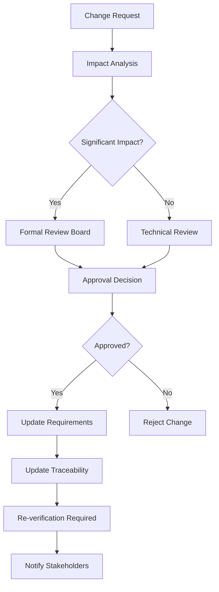

# IEC 62304: Software Development Planning and Requirements Analysis

## Module Overview
This module covers comprehensive software development planning and systematic requirements analysis processes for medical device software. It focuses on establishing robust planning frameworks and ensuring complete, traceable requirements.

**Key Areas Covered:**
- Software development planning and lifecycle models
- Comprehensive requirements analysis and documentation
- Requirements verification and approval processes
- Change management for planning and requirements

---

## 5. Software Development Planning

### 5.1 General

The manufacturer shall plan the software development process for each software system.

**AI-Agent Planning Considerations**:
- Resource optimisation algorithms
- Schedule constraint satisfaction
- Risk-based planning prioritisation
- Automated milestone tracking

### 5.2 Plan the Software Development Process

#### 5.2.1 Software Development Plan

The manufacturer shall document the software development process in a software development plan.

**Minimum Content Requirements Structure**:

**A) Purpose and Scope**
- Software system identification
- Intended use and operational environment
- Hardware and software operating environment

**B) Organisation and Responsibilities**
- Organisational structure for the project
- Tasks and responsibilities of each organisation
- Personnel qualifications and training requirements

**C) Relationship to Overall Medical Device Development**
- Integration with overall medical device development
- Interface to medical device risk management
- Interface to medical device design controls

**D) Software Development Standards**
- Applicable development standards and methods
- Programming languages and tools
- Documentation standards
- Verification and validation standards

**E) Software Life Cycle Model**
- Description of the chosen life cycle model
- Definition of life cycle phases and deliverables
- Entry and exit criteria for each phase

**F) Verification and Validation**
- Verification and validation planning
- Methods and tools for V&V activities
- Acceptance criteria for each life cycle phase

**G) Risk Management Activities**
- Software risk management process
- Integration with medical device risk management
- Risk control measures

**H) Configuration Management**
- Configuration identification scheme
- Change control procedures
- Configuration status accounting

**I) Problem Resolution**
- Problem reporting and tracking procedures
- Problem analysis and resolution methods
- Corrective and preventive action procedures

#### 5.2.2 Keep Software Development Plan Current

The manufacturer shall keep the software development plan current throughout the software development process.

**Plan Maintenance Protocol**:
```yaml
update_triggers:
  - scope_changes
  - resource_modifications
  - schedule_adjustments
  - regulatory_updates
  - technology_changes
update_process:
  - impact_assessment
  - stakeholder_review
  - approval_workflow
  - distribution_update
  - version_control
```

### 5.3 Software Development Life Cycle Model

#### 5.3.1 Select Life Cycle Model

The manufacturer shall select an appropriate life cycle model for the development of the software system, considering:

**Selection Criteria Matrix**:
| Factor | Waterfall | V-Model | Incremental | Spiral | Agile |
|--------|-----------|---------|-------------|---------|-------|
| Project Size | Large | Large | Medium-Large | Medium | Small-Medium |
| Complexity | Low-Medium | Medium | Medium-High | High | Low-Medium |
| Requirements Stability | High | High | Medium | Low | Low |
| Risk Level | Low | Medium | Medium | High | Low |
| Regulatory Environment | High | High | Medium | Medium | Low |

**Common Life Cycle Models**:

**Waterfall Model**: 
- Sequential phases with formal reviews
- Suitable for stable requirements and low-risk projects
- Extensive documentation at each phase

**V-Model**: 
- Emphasises verification and validation
- Strong traceability between development and testing phases
- Excellent for safety-critical applications

**Incremental Model**: 
- Multiple software releases with incremental functionality
- Enables early delivery of core features
- Facilitates requirement evolution

**Spiral Model**: 
- Risk-driven iterative approach
- Continuous risk assessment and mitigation
- Suitable for high-uncertainty projects

**Agile Models**: 
- Iterative and incremental with frequent customer interaction
- Adaptive to changing requirements
- Requires careful adaptation for regulated environments

#### 5.3.2 Document Selected Model

The manufacturer shall document the rationale for selecting the life cycle model and describe how the selected model addresses the specific needs of the project.

---

## 6. Software Requirements Analysis

### 6.1 General

The manufacturer shall analyse and document the software requirements for each software system.

**AI-Agent Requirements Analysis Framework**:
- Natural language processing for requirements extraction
- Automated consistency checking
- Traceability link generation
- Requirements completeness assessment

### 6.2 Define and Document Software Requirements

#### 6.2.1 Functional and Capability Requirements

The manufacturer shall define and document software requirements including:

**A) Functional Requirements**
```yaml
input_output_specifications:
  - data_types
  - value_ranges
  - format_specifications
  - validation_rules
data_formats:
  - structure_definitions
  - encoding_standards
  - precision_requirements
processing_requirements:
  - algorithmic_specifications
  - computational_complexity
  - accuracy_requirements
response_times:
  - maximum_latency
  - throughput_specifications
  - real_time_constraints
system_behaviour:
  - state_transitions
  - error_conditions
  - boundary_conditions
```

**B) Performance Requirements**
```yaml
response_time:
  - user_interface_response
  - computational_response
  - communication_response
throughput:
  - data_processing_rate
  - transaction_volume
  - concurrent_operations
memory_utilisation:
  - maximum_allocation
  - dynamic_allocation
  - memory_leaks_prevention
resource_usage:
  - cpu_utilisation
  - storage_requirements
  - network_bandwidth
```

**C) Interface Requirements**
```yaml
hardware_interfaces:
  - sensor_interfaces
  - actuator_interfaces
  - communication_ports
software_interfaces:
  - api_specifications
  - protocol_definitions
  - data_exchange_formats
user_interfaces:
  - usability_requirements
  - accessibility_requirements
  - user_experience_specifications
communication_interfaces:
  - network_protocols
  - security_requirements
  - interoperability_standards
```

**D) Clinical Performance Requirements**
```yaml
accuracy_requirements:
  - measurement_precision
  - calculation_accuracy
  - diagnostic_accuracy
precision_requirements:
  - repeatability
  - reproducibility
  - measurement_uncertainty
clinical_safety_requirements:
  - patient_safety_measures
  - clinical_risk_controls
  - adverse_event_prevention
usability_requirements:
  - user_error_prevention
  - workflow_optimisation
  - training_requirements
```

#### 6.2.2 Software System Inputs and Outputs

The manufacturer shall identify and document:

**Input/Output Specification Template**:
```json
{
  "inputs": {
    "input_id": {
      "description": "string",
      "data_type": "string",
      "acceptable_range": {"min": "value", "max": "value"},
      "validation_rules": ["rule1", "rule2"],
      "source": "string"
    }
  },
  "outputs": {
    "output_id": {
      "description": "string",
      "data_type": "string",
      "acceptable_range": {"min": "value", "max": "value"},
      "target": "string",
      "accuracy_requirements": "string"
    }
  },
  "relationships": {
    "input_output_mapping": "mathematical_relationship",
    "dependencies": ["input1", "input2"]
  },
  "invalid_input_handling": {
    "detection_methods": ["method1", "method2"],
    "response_actions": ["action1", "action2"]
  }
}
```

#### 6.2.3 Software Requirements Content

Each software requirement shall be:

**Requirement Quality Attributes**:
- **Unambiguous**: Clear and precise meaning without interpretation ambiguity
- **Traceable**: Linked to system requirements and risk analysis
- **Testable**: Verifiable through testing or analysis methods
- **Feasible**: Technically achievable within project constraints
- **Necessary**: Required for the intended use and regulatory compliance

**AI-Agent Quality Assessment Algorithm**:
```python
def assess_requirement_quality(requirement):
    quality_score = 0
    
    # Check unambiguous
    if has_clear_language(requirement) and not has_ambiguous_terms(requirement):
        quality_score += 20
    
    # Check traceable
    if has_traceability_links(requirement):
        quality_score += 20
    
    # Check testable
    if has_acceptance_criteria(requirement) and has_measurable_outcomes(requirement):
        quality_score += 20
    
    # Check feasible
    if within_technical_constraints(requirement) and within_resource_constraints(requirement):
        quality_score += 20
    
    # Check necessary
    if supports_intended_use(requirement) and required_by_regulation(requirement):
        quality_score += 20
    
    return quality_score
```

#### 6.2.4 Include Risk Control Measures

The manufacturer shall include in software requirements the risk control measures identified by the risk management process.

**Risk Control Integration Matrix**:
| Risk Level | Control Measure Type | Implementation Location |
|------------|---------------------|------------------------|
| High | Safety by Design | Requirements & Architecture |
| Medium | Protective Measures | Software Implementation |
| Low | Information for Safety | User Interface & Documentation |

#### 6.2.5 Software Requirements Updating

The manufacturer shall establish procedures for updating software requirements:

**Change Control Workflow**:


### 6.3 Software Requirements Verification

#### 6.3.1 Verify Software Requirements

The manufacturer shall verify software requirements to ensure they:

**Verification Checklist**:
- [ ] Implement system requirements allocated to software
- [ ] Are complete, unambiguous, and consistent
- [ ] Do not contradict each other
- [ ] Are expressed in terms that permit establishment of test criteria
- [ ] Address risk control measures

**Verification Methods Framework**:

**Reviews and Analysis**:
```yaml
systematic_examination:
  - peer_review
  - formal_inspection
  - walkthrough
  - checklist_based_review
qualified_personnel:
  - domain_experts
  - requirements_specialists
  - safety_engineers
review_criteria:
  - completeness
  - consistency
  - correctness
  - traceability
```

**Prototyping**:
```yaml
feasibility_demonstrations:
  - proof_of_concept
  - user_interface_mockups
  - algorithm_validation
completeness_validation:
  - scenario_execution
  - user_story_validation
  - edge_case_exploration
```

**Modelling**:
```yaml
mathematical_models:
  - formal_specifications
  - state_machines
  - data_flow_models
simulation_models:
  - behaviour_simulation
  - performance_modelling
  - risk_scenario_analysis
```

**Testing**:
```yaml
requirement_based_tests:
  - acceptance_tests
  - scenario_tests
  - boundary_tests
executable_specifications:
  - behaviour_driven_development
  - model_based_testing
  - property_based_testing
```

#### 6.3.2 Document Verification Results

The manufacturer shall document the results of software requirements verification:

**Verification Documentation Template**:
```json
{
  "verification_activity": {
    "activity_id": "string",
    "method_used": "string",
    "participants": ["person1", "person2"],
    "date_conducted": "ISO_date",
    "requirements_verified": ["req_id1", "req_id2"]
  },
  "results": {
    "findings": [
      {
        "finding_id": "string",
        "description": "string",
        "severity": "high|medium|low",
        "requirement_affected": "req_id"
      }
    ],
    "overall_assessment": "pass|conditional_pass|fail"
  },
  "actions_taken": [
    {
      "action_id": "string",
      "description": "string",
      "responsible_person": "string",
      "due_date": "ISO_date",
      "status": "open|in_progress|completed"
    }
  ],
  "evidence": [
    {
      "evidence_type": "document|test_result|review_record",
      "location": "file_path_or_reference",
      "description": "string"
    }
  ]
}
```

### 6.4 Software Requirements Approval

#### 6.4.1 Obtain Approval

The manufacturer shall obtain approval of software requirements from authorised personnel before proceeding with architectural design.

**Approval Authority Matrix**:
| Safety Class | Required Approvers | Approval Criteria |
|-------------|-------------------|-------------------|
| Class A | Technical Lead, Quality Assurance | Technical adequacy, Quality standards |
| Class B | Technical Lead, Quality Assurance, Safety Engineer | Above + Safety assessment |
| Class C | Technical Lead, Quality Assurance, Safety Engineer, Medical Director | Above + Clinical validation |

#### 6.4.2 Approval Documentation

The approval documentation shall include:

**Approval Record Template**:
```json
{
  "approval_record": {
    "document_title": "Software Requirements Specification",
    "document_version": "string",
    "approval_date": "ISO_date",
    "approvers": [
      {
        "name": "string",
        "role": "string",
        "signature": "electronic_signature",
        "approval_scope": "full|conditional|partial"
      }
    ],
    "conditions_constraints": [
      {
        "condition_id": "string",
        "description": "string",
        "resolution_required": "boolean"
      }
    ],
    "next_review_date": "ISO_date",
    "distribution_list": ["person1", "person2"]
  }
}
```

---

## Related Documents

- [Scope and Classification](01-scope-and-classification.md)
- [Design and Architecture](03-design-architecture.md)
- [Implementation and Testing](04-implementation-testing.md)
- [Release and Maintenance](05-release-maintenance.md)
- [Supporting Processes](06-supporting-processes.md)
- [AI Automation Schemas](ai-automation-schemas/)
- [Code Examples](code-examples/)