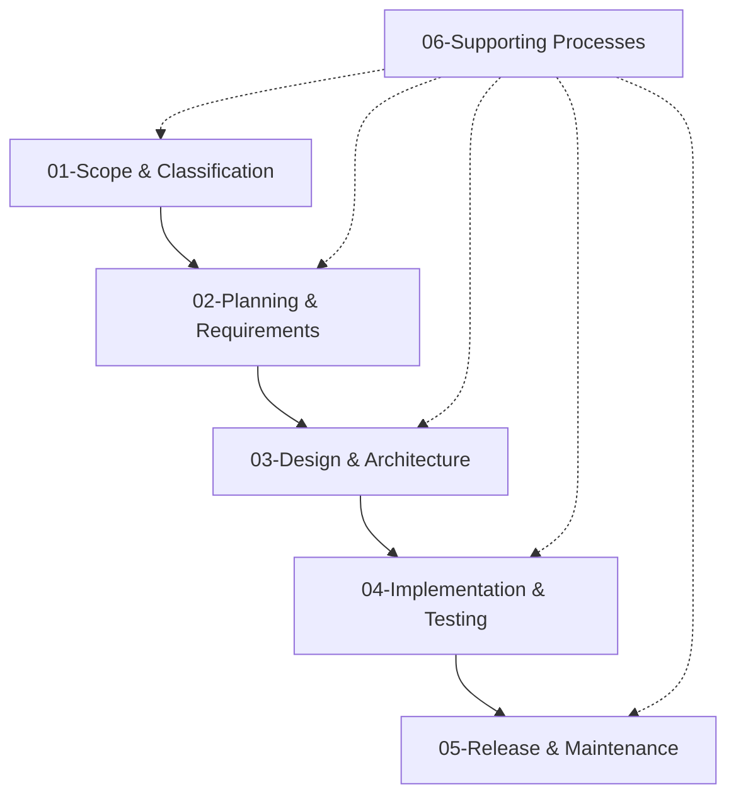
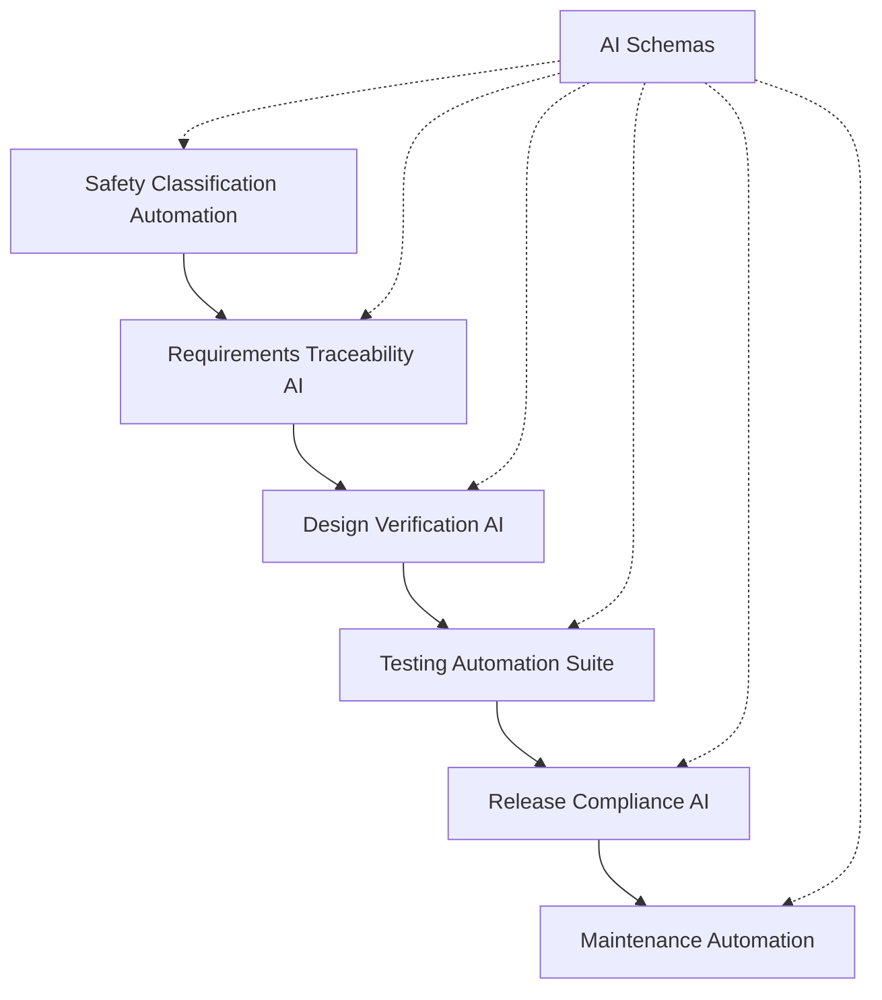
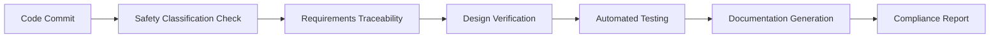

# IEC 62304:2006 - Medical Device Software Lifecycle Processes
## AI-Optimised Modular Reference

This directory contains a comprehensive, modular implementation of IEC 62304:2006 specifically optimised for AI agent processing and modern software development workflows. The content has been functionally decomposed from the original monolithic document into focused, interconnected modules that facilitate automated compliance checking, workflow generation, and systematic medical device software development.

## 📋 Document Overview

**Standard**: IEC 62304:2006  
**Title**: Medical device software — Software life cycle processes  
**Scope**: Software life cycle processes for medical device software  
**Safety Classifications**: Class A (Non-injury), Class B (Non-life-threatening), Class C (Life-threatening)  
**Integration Standards**: ISO 13485, ISO 14971, IEC 60601-1  

## 🏗️ Modular Structure

### Core Lifecycle Modules

| Module | Sections | Focus Area | AI Optimisation |
|--------|----------|------------|-----------------|
| **[01-scope-and-classification](01-scope-and-classification.md)** | 1-4 | Foundation & Safety Classification | Automated classification algorithms |
| **[02-planning-and-requirements](02-planning-and-requirements.md)** | 5-6 | Planning & Requirements Analysis | Requirements traceability automation |
| **[03-design-architecture](03-design-architecture.md)** | 7-8 | Architectural & Detailed Design | Design verification automation |
| **[04-implementation-testing](04-implementation-testing.md)** | 9-11 | Implementation & Testing | Comprehensive testing automation |
| **[05-release-maintenance](05-release-maintenance.md)** | 12-13 | Release & Maintenance | Release automation & maintenance workflows |
| **[06-supporting-processes](06-supporting-processes.md)** | 14-16 | Risk, Configuration & Problem Resolution | Cross-process automation |

### Automation Resources

| Directory | Purpose | Contents |
|-----------|---------|----------|
| **[ai-automation-schemas/](ai-automation-schemas/)** | JSON schemas for process automation | Validation, workflow, and compliance schemas |
| **[code-examples/](code-examples/)** | Implementation examples | Python, JavaScript, C++, and shell examples |

## 🚀 Quick Start Guide

### For AI Agents and Automation Systems
1. **Process Automation**: Use [AI automation schemas](ai-automation-schemas/) to implement compliant workflows
2. **Classification**: Leverage [safety classification automation](01-scope-and-classification.md#13-software-safety-classification)
3. **Verification**: Implement [automated verification processes](04-implementation-testing.md#93-software-unit-verification-unit-testing)
4. **Compliance Checking**: Use structured templates for [requirements traceability](02-planning-and-requirements.md#63-software-requirements-verification)

### For Development Teams
1. **Start Here**: Review [scope and classification](01-scope-and-classification.md) to understand applicability
2. **Plan**: Follow [planning and requirements](02-planning-and-requirements.md) for systematic development
3. **Design**: Use [design and architecture](03-design-architecture.md) for compliant system design
4. **Implement**: Apply [implementation and testing](04-implementation-testing.md) for comprehensive verification
5. **Deploy**: Follow [release and maintenance](05-release-maintenance.md) for controlled deployment
6. **Support**: Integrate [supporting processes](06-supporting-processes.md) for ongoing compliance

### For Regulatory Compliance
1. **Evidence Generation**: Each module includes comprehensive documentation templates
2. **Audit Trails**: Automated audit trail generation through AI schemas
3. **Traceability**: Complete requirements-to-code traceability frameworks
4. **Validation**: Systematic validation approaches for all safety classes

## 📊 Safety Classification Quick Reference

### Class A Software (Non-Injury)
- **Risk Level**: LOW
- **Testing**: Basic functional testing
- **Documentation**: Standard documentation requirements
- **Modules**: All modules applicable with basic requirements
- **Automation**: Focus on [basic workflow automation](ai-automation-schemas/software-lifecycle-process.schema.json)

### Class B Software (Non-Life-Threatening)  
- **Risk Level**: MEDIUM
- **Testing**: Enhanced testing with statement OR branch coverage
- **Documentation**: Comprehensive documentation requirements
- **Modules**: All modules with enhanced verification requirements
- **Automation**: Implement [comprehensive verification automation](04-implementation-testing.md#932-software-unit-testing)

### Class C Software (Life-Threatening)
- **Risk Level**: HIGH  
- **Testing**: Extensive testing with statement AND branch coverage
- **Documentation**: Exhaustive documentation requirements
- **Modules**: All modules with maximum verification requirements
- **Automation**: Full [automation suite](ai-automation-schemas/) with independent verification

## 🔄 Process Integration Workflows

### Standard Development Workflow


### AI-Enhanced Workflow


## 📈 Key Features and Benefits

### AI/Agent Optimisations
- **Structured Data**: JSON schemas for all processes enable automated validation
- **Decision Matrices**: Algorithm-ready decision frameworks for automated compliance
- **Template Libraries**: Comprehensive templates for automated documentation generation
- **Workflow Automation**: Complete workflow definitions for CI/CD integration
- **Traceability Automation**: Automated requirements-to-verification traceability

### Compliance Enhancements
- **Complete Coverage**: All IEC 62304 requirements systematically addressed
- **Safety Class Tailoring**: Specific requirements for Class A, B, and C software
- **Integration Ready**: Seamless integration with ISO 13485, ISO 14971, IEC 60601-1
- **Audit Preparation**: Comprehensive evidence generation and management
- **Regulatory Submission**: Ready-to-submit documentation packages

### Development Efficiency
- **Modular Approach**: Focus on relevant modules for your development phase
- **Parallel Processing**: Independent modules enable parallel development streams
- **Reusable Frameworks**: Templates and schemas accelerate compliant development
- **Quality Gates**: Automated quality gates prevent compliance issues
- **Continuous Validation**: Real-time compliance checking throughout development

## 🛠️ Implementation Examples

### Automated Safety Classification
```python
# See code-examples/safety-classification/safety_classifier.py
classifier = SoftwareSafetyClassifier('config.yaml')
result = classifier.classify_software_system(hazards_data)
print(f"Classification: {result['overall_classification']}")
```

### Schema-Driven Process Validation
```javascript
// Using JSON Schema validation
const schema = require('./ai-automation-schemas/software-lifecycle-process.schema.json');
const validate = ajv.compile(schema);
const valid = validate(processData);
```

### CI/CD Integration
```yaml
# GitHub Actions example
- name: Validate IEC 62304 Compliance
  uses: ./actions/iec62304-validator
  with:
    safety_class: 'Class_B'
    schema_path: './docs/iec62304/ai-automation-schemas/'
```

## 📚 Cross-References and Integration

### Internal Cross-References
- **Requirements to Design**: [02-planning-and-requirements](02-planning-and-requirements.md) → [03-design-architecture](03-design-architecture.md)
- **Design to Implementation**: [03-design-architecture](03-design-architecture.md) → [04-implementation-testing](04-implementation-testing.md)
- **Testing to Release**: [04-implementation-testing](04-implementation-testing.md) → [05-release-maintenance](05-release-maintenance.md)
- **All Phases to Supporting**: [06-supporting-processes](06-supporting-processes.md) integrates with all modules

### External Standard Integration
- **ISO 13485**: Quality management system integration points in all modules
- **ISO 14971**: Risk management process integration in [06-supporting-processes](06-supporting-processes.md)
- **IEC 60601-1**: Safety and performance requirements integration throughout

### Tool Chain Integration
- **Version Control**: Configuration management in [06-supporting-processes](06-supporting-processes.md)
- **CI/CD Systems**: Automation schemas enable pipeline integration
- **Quality Tools**: Quality metrics and automated review processes
- **Documentation Systems**: Template-driven documentation generation

## 🔍 Search and Navigation

### By Development Phase
- **Planning Phase**: [02-planning-and-requirements](02-planning-and-requirements.md)
- **Design Phase**: [03-design-architecture](03-design-architecture.md)
- **Implementation Phase**: [04-implementation-testing](04-implementation-testing.md)
- **Release Phase**: [05-release-maintenance](05-release-maintenance.md)

### By Safety Class Requirements
- **Class A Requirements**: Search modules for "Class A" specific requirements
- **Class B Requirements**: Enhanced requirements throughout all modules  
- **Class C Requirements**: Comprehensive requirements with additional verification

### By Process Type
- **Primary Processes**: Modules 01-05 (main development lifecycle)
- **Supporting Processes**: Module 06 (risk management, configuration, problem resolution)
- **Automation Processes**: AI schemas and code examples

### By Deliverable Type
- **Documentation**: Templates and frameworks in each module
- **Code Artifacts**: Implementation examples and standards
- **Verification Evidence**: Testing and review procedures
- **Compliance Evidence**: Audit trails and regulatory documentation

## ⚡ Advanced Usage Patterns

### Multi-Project Management
```yaml
# Configuration for managing multiple medical device software projects
projects:
  - name: "CardiacMonitor_Software"
    safety_class: "Class_C"
    modules: ["01", "02", "03", "04", "05", "06"]
    
  - name: "DataLogger_Utility"  
    safety_class: "Class_A"
    modules: ["01", "02", "04", "05"]
```

### Automated Compliance Pipeline


### Risk-Based Development
- Prioritise high-risk components using [06-supporting-processes](06-supporting-processes.md) risk management
- Tailor verification intensity based on safety classification
- Automate risk control measure verification

## 📋 Maintenance and Updates

### Version Control Strategy
- Each module independently versioned for precise change tracking
- AI schemas versioned separately to maintain backward compatibility
- Code examples updated to reflect current best practices

### Continuous Improvement
- Regular updates based on regulatory guidance evolution
- Community feedback integration for practical applicability
- Tool integration examples updated for current technology stacks

### Change Impact Assessment
- Automated impact analysis for standard updates
- Cross-module dependency tracking
- Backward compatibility maintenance for established workflows

## 🤝 Contributing and Support

### For Contributors
1. Maintain regulatory accuracy and completeness
2. Ensure AI/agent processing optimisation
3. Provide practical, implementable examples
4. Include comprehensive test coverage

### For Users
1. **Questions**: Each module includes comprehensive guidance
2. **Issues**: Report problems with specific module references
3. **Enhancements**: Suggest improvements with safety class context
4. **Integration**: Share successful tool chain integrations

---

## 📖 Related Documentation

- **Original Standard**: IEC 62304:2006 (official purchase required)
- **Companion Standards**: ISO 13485, ISO 14971, IEC 60601-1
- **Implementation Guidance**: FDA Software Guidance Documents
- **Quality Management**: ISO 9001 integration patterns

## 🏷️ Document Metadata

**Document Type**: AI-Optimised Modular Reference  
**Target Audience**: AI Agents, Development Teams, QA Engineers, Regulatory Affairs  
**Automation Level**: High (JSON schemas, templates, code examples)  
**Compliance Level**: Full IEC 62304:2006 coverage  
**Update Frequency**: Quarterly or upon significant regulatory changes  

**AI Processing Tags**: `medical-software`, `lifecycle-management`, `safety-critical`, `regulatory-compliance`, `automation-ready`, `schema-driven`, `template-based`

---

*This modular reference transforms the traditional approach to IEC 62304 compliance by providing AI-optimised, automation-ready processes that maintain full regulatory compliance while dramatically improving development efficiency and quality assurance.*